# Product Requirements Document: pi-claude-marketplace

**Document version:** 1.0 (derived from the existing implementation) **Status:** Reference for designing a successor architecture **Audience:** Architects, engineers, and product owners building the next iteration

______________________________________________________________________

## Table of Contents

- [Product Requirements Document: pi-claude-marketplace](#product-requirements-document-pi-claude-marketplace)
  - [Table of Contents](#table-of-contents)
  - [1. Overview & Purpose](#1-overview--purpose)
    - [Goals](#goals)
    - [Non-goals (V1)](#non-goals-v1)
  - [2. Personas, Goals, and Use Cases](#2-personas-goals-and-use-cases)
  - [3. Glossary](#3-glossary)
  - [4. System Context](#4-system-context)
  - [5. Functional Requirements -- Vertical (Per Feature)](#5-functional-requirements----vertical-per-feature)
    - [5.1 Marketplace Lifecycle](#51-marketplace-lifecycle)
      - [5.1.1 `marketplace add <source> [--scope user|project]`](#511-marketplace-add-source---scope-userproject)
      - [5.1.2 `marketplace remove <name> [--scope user|project]` (alias `rm`)](#512-marketplace-remove-name---scope-userproject-alias-rm)
      - [5.1.3 `marketplace list [--scope user|project]`](#513-marketplace-list---scope-userproject)
      - [5.1.4 `marketplace update [<name>] [--scope user|project]`](#514-marketplace-update-name---scope-userproject)
      - [5.1.5 `marketplace autoupdate [<name>]` and `marketplace noautoupdate [<name>]`](#515-marketplace-autoupdate-name-and-marketplace-noautoupdate-name)
    - [5.2 Plugin Lifecycle](#52-plugin-lifecycle)
      - [5.2.1 `install <plugin>@<marketplace> [--scope user|project] [--map-model]`](#521-install-pluginmarketplace---scope-userproject---map-model)
      - [5.2.2 `uninstall <plugin>@<marketplace> [--scope user|project]`](#522-uninstall-pluginmarketplace---scope-userproject)
      - [5.2.3 `update [<plugin>@<marketplace> | @<marketplace>] [--scope user|project] [--map-model]`](#523-update-pluginmarketplace--marketplace---scope-userproject---map-model)
    - [5.3 Listing & Inspection](#53-listing--inspection)
      - [5.3.1 `list [<marketplace>] [--installed] [--available] [--unavailable] [--scope user|project]`](#531-list-marketplace---installed---available---unavailable---scope-userproject)
    - [5.4 Autoupdate & Update Cascade](#54-autoupdate--update-cascade)
    - [5.5 Skills Bridge (Pi resources)](#55-skills-bridge-pi-resources)
    - [5.6 Commands Bridge (Pi prompt templates)](#56-commands-bridge-pi-prompt-templates)
    - [5.7 Agents Bridge (pi-subagents soft dependency)](#57-agents-bridge-pi-subagents-soft-dependency)
    - [5.8 MCP Servers Bridge (pi-mcp-adapter soft dependency)](#58-mcp-servers-bridge-pi-mcp-adapter-soft-dependency)
  - [6. Functional Requirements -- Horizontal (Cross-cutting)](#6-functional-requirements----horizontal-cross-cutting)
    - [6.1 Source Parsing & Validation](#61-source-parsing--validation)
    - [6.2 Scopes & Resolution](#62-scopes--resolution)
      - [6.2.1 Scope-aware Marketplace/Plugin Rules](#621-scope-aware-marketplaceplugin-rules)
    - [6.3 Manifest Schema & Strict Mode](#63-manifest-schema--strict-mode)
    - [6.4 Plugin Compatibility Resolver](#64-plugin-compatibility-resolver)
    - [6.5 Resource Naming, Generation & Conflicts](#65-resource-naming-generation--conflicts)
    - [6.6 Tab Completion](#66-tab-completion)
    - [6.7 Argument Parsing](#67-argument-parsing)
    - [6.8 Reload Hint & Soft-Dependency Probing](#68-reload-hint--soft-dependency-probing)
    - [6.9 State Persistence, Migration & Concurrency](#69-state-persistence-migration--concurrency)
    - [6.10 Path Safety & Containment](#610-path-safety--containment)
    - [6.11 Atomic Staging, Commit & Rollback](#611-atomic-staging-commit--rollback)
    - [6.12 Error Surfaces & Severity](#612-error-surfaces--severity)
    - [6.13 Internationalization, Logging & Telemetry](#613-internationalization-logging--telemetry)
  - [7. User Journeys](#7-user-journeys)
    - [7.1 First-time install (happy path)](#71-first-time-install-happy-path)
    - [7.2 Plugin with agents and MCP servers, soft-deps unloaded (degraded path)](#72-plugin-with-agents-and-mcp-servers-soft-deps-unloaded-degraded-path)
    - [7.3 GitHub source -- non-fast-forward divergence (unhappy path, recovery)](#73-github-source----non-fast-forward-divergence-unhappy-path-recovery)
    - [7.4 Plugin removal with locked data dir (warning, retryable)](#74-plugin-removal-with-locked-data-dir-warning-retryable)
    - [7.5 Concurrent install converges via state-guard (race recovery)](#75-concurrent-install-converges-via-state-guard-race-recovery)
    - [7.6 Marketplace remove with unloaded soft-deps (warning surfaces, hint emitted)](#76-marketplace-remove-with-unloaded-soft-deps-warning-surfaces-hint-emitted)
  - [8. State Diagrams](#8-state-diagrams)
    - [8.1 Per-plugin state](#81-per-plugin-state)
    - [8.2 Per-marketplace state](#82-per-marketplace-state)
    - [8.3 Install transaction](#83-install-transaction)
    - [8.4 Update transaction (3-phase)](#84-update-transaction-3-phase)
  - [9. Architecture Diagrams](#9-architecture-diagrams)
    - [9.1 Extension module layout (V1)](#91-extension-module-layout-v1)
    - [9.2 Persistence layout per scope](#92-persistence-layout-per-scope)
    - [9.3 Soft-dependency probing](#93-soft-dependency-probing)
  - [10. Non-functional Requirements](#10-non-functional-requirements)
  - [11. Out of Scope (V1)](#11-out-of-scope-v1)
  - [12. Acceptance Criteria Summary](#12-acceptance-criteria-summary)
  - [Appendix A: Subcommand index](#appendix-a-subcommand-index)
  - [Appendix B: Generated-name conventions](#appendix-b-generated-name-conventions)
  - [Appendix C: Reload-hint verbs](#appendix-c-reload-hint-verbs)

______________________________________________________________________

## 1. Overview & Purpose

`pi-claude-marketplace` is a Pi extension that gives Pi users access to Claude plugin marketplaces using a command surface intentionally aligned with Claude Code's upstream `/plugin`. The extension translates Claude plugin artefacts (skills, commands, agents, MCP servers) into the equivalent Pi-native artefacts (Pi skills, Pi prompt templates, pi-subagents agents, pi-mcp-adapter MCP entries) and manages the lifecycle of those translations (install, update, uninstall, remove, list).

### Goals

- **Reuse the Claude plugin ecosystem from inside Pi** -- every supported Claude plugin component should be installable through a single namespaced command (`/claude:plugin …`).
- **Preserve familiar UX** -- subcommand names, syntax for plugin references (`<plugin>@<marketplace>`), and source forms (`owner/repo`, `https://github.com/...#<ref>`, local paths) match Claude Code parity within the V1 scope.
- **Two scopes only** -- `user` (Pi agent dir, default `~/.pi/agent/`, honoring `PI_CODING_AGENT_DIR`) and `project` (`<cwd>/.pi/`), mirroring Pi's scope model rather than Claude Code's `local` scope.
- **Soft-degrade** -- features that require companion extensions (`pi-subagents`, `pi-mcp-adapter`) must not block installs; instead they degrade gracefully with explicit guidance.
- **Atomic, recoverable operations** -- install, update, uninstall, and marketplace removal must never leave on-disk artefacts and persisted state in irrecoverable disagreement; failures must surface a recovery path.

### Non-goals (V1)

- Claude `local` scope (no Pi equivalent).
- SSH or arbitrary git URLs, remote `marketplace.json` URLs, sparse checkouts, browser-paste tree URLs (`/tree/<ref>`).
- Plugin sources beyond local relative paths (`./`, `../`); GitHub object/git-URL/git-subdir/npm sources are parsed and listed as **unavailable**.
- Components beyond skills, commands, agents, and MCP servers (hooks, LSP servers, monitors, themes, output styles, channels, userConfig, bin, settings) -- detected and surfaced as **unavailable** with explanatory notes.
- Automatic dependency resolution; declared `dependencies` produce a manual-install warning only.
- Mutating LLM tools (install/update/uninstall) -- only listing tools are exposed.

______________________________________________________________________

## 2. Personas, Goals, and Use Cases

| Persona                     | Goal                                                                           | Representative use cases                                                                                                                         |
| --------------------------- | ------------------------------------------------------------------------------ | ------------------------------------------------------------------------------------------------------------------------------------------------ |
| **Pi end user (developer)** | Install familiar Claude plugins inside Pi without restarting                   | Add a marketplace; browse plugins; install/uninstall plugins; pin a marketplace to a tag; inspect what's installed; refresh upstream changes     |
| **Project lead**            | Curate a per-project marketplace set so the team gets the same skills/commands | Add a marketplace to project scope; commit `.pi/` artefacts; document a `pi install` flow                                                        |
| **Plugin author**           | Verify plugins resolve correctly under Pi                                      | Install from a local path source; verify all components stage; verify update flow lands new version                                              |
| **Operator / power user**   | Detect drift, recover from broken state                                        | Diagnose unavailable plugins (component or source-kind reasons); recover from non-fast-forward divergence; recover after partial-failure removal |

______________________________________________________________________

## 3. Glossary

- **Pi** -- the host coding agent (`@mariozechner/pi-coding-agent`).
- **Extension** -- a Pi extension; this product registers the `claude:plugin` LLM tool family, one `resources_discover` listener (the bridge that exposes staged skills/prompts to Pi), and one `session_start` listener (the wrapper that adds `/claude:plugin`-scoped fish-style space normalization to the autocomplete provider; see §6.6 TC-7).
- **Scope** -- `user` or `project`. User scope writes to the Pi agent dir (default `~/.pi/agent/`, overridden by `PI_CODING_AGENT_DIR`); project scope writes to `<cwd>/.pi/`.
- **Marketplace** -- a Claude marketplace, identified by a name from its `marketplace.json`. A marketplace record is scoped: it may be added to `user` scope, `project` scope, or both.
- **Marketplace source** -- how a marketplace is fetched: GitHub `owner/repo[#<ref>]`, GitHub HTTPS URL, or a local path.
- **Plugin** -- a Claude plugin, identified by `<plugin>@<marketplace>`. A plugin install record is scoped independently from the marketplace record that supplied its manifest/source.
- **Target scope** -- the scope where a mutating plugin operation writes or changes the plugin install record and generated Pi artefacts.
- **Component** -- one of skills, commands, agents (supported), or hooks, lspServers, monitors, themes, outputStyles, channels, userConfig, bin, settings (unsupported), plus mcpServers (supported, with soft dep).
- **Strict marketplace** -- `marketplace.json` `strict: true` (default) → resolver takes the union of four declaration sources: the marketplace-entry component fields, the plugin-manifest component fields, implicit-by-convention directories (`skills/`, `commands/`, `agents/`), and standalone files at the plugin root (`hooks/hooks.json`, `.mcp.json`). `strict: false` → resolver uses the marketplace-entry declarations only and treats any of the other three sources declaring unsupported components (or declaring `mcpServers` without a matching entry-level declaration) as conflicts.
- **Generated name** -- the deterministic name produced for a Pi-side artefact: `<plugin>-<skill>` for skills, `<plugin>:<command>` for commands, `pi-claude-marketplace-<plugin>-<agent>` for agents.
- **Reload hint** -- the trailing `Run /reload to <verb> ...` line appended to messages whenever generated resources changed.
- **Soft dependency** -- a runtime dependency probed via tool registration, not via a manifest field. `pi-subagents` (probed by the `subagent` tool) and `pi-mcp-adapter` (probed by tool name `mcp` or `sourceInfo.source` containing `pi-mcp-adapter`).
- **State guard** -- a transactional helper that re-reads state on entry, applies a closure, and atomically saves; throws and skips save on closure throw.
- **Installable** -- the resolver returned `installable: true` for the plugin: source kind is `path`, source dir exists, manifest is well-formed, no unsupported components are declared, no path-containment violation. An installable plugin can be installed; it is not yet installed unless a state record exists.
- **Installed** -- a state record for `(target scope, marketplace, plugin)` exists in `state.json`; the plugin's resources are presumed staged on disk per the record's `resources.*` fields.
- **Available** -- shorthand used by the `list` subcommand and install completion for plugins that are installable AND not currently installed in the chosen target scope. Available plugins can be installed without warnings other than the ones the resolver attached as notes.
- **Unavailable** -- shorthand used by the `list` subcommand for plugins for which the resolver returned `installable: false`. Unavailable plugins surface their reason as a resolver note (e.g., `contains hooks`, `unsupported source kind: github`).

______________________________________________________________________

## 4. System Context

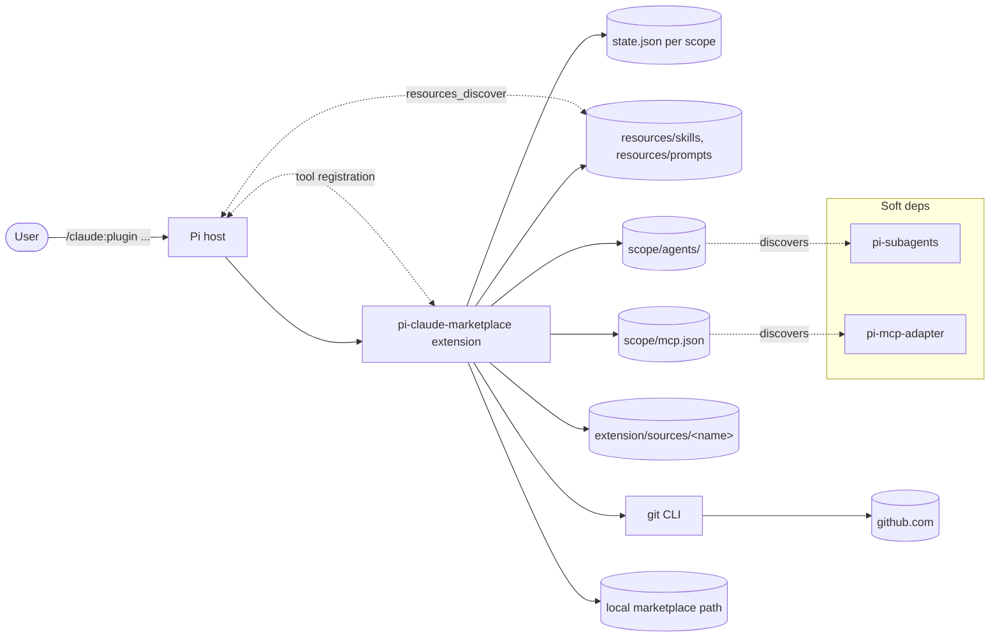

The extension owns three persistence surfaces:

1. **`<scope>/pi-claude-marketplace/state.json`** -- single source of truth for which marketplaces are configured, source kinds, plugin install records (skills, prompts, agents, mcpServers), versions, autoupdate flags, etc.
2. **`<scope>/pi-claude-marketplace/resources/{skills,prompts}/`** -- generated Pi skill directories and prompt template files, exposed back to Pi via `resources_discover`.
3. **Out-of-extension bridge files** for soft deps:
   - `<scope>/agents/pi-claude-marketplace-*.md` (with a separate `<extension>/agents-index.json`).
   - `<scope>/mcp.json` (entries marked with `_piClaudeMarketplace: { plugin, marketplace }`).

______________________________________________________________________

## 5. Functional Requirements -- Vertical (Per Feature)

### 5.1 Marketplace Lifecycle

#### 5.1.1 `marketplace add <source> [--scope user|project]`

| ID        | Requirement                                                                                                                                                                                                                                           |
| --------- | ----------------------------------------------------------------------------------------------------------------------------------------------------------------------------------------------------------------------------------------------------- |
| **MA-1**  | The user MUST be able to add a marketplace by `owner/repo`, by `https://github.com/owner/repo[.git]`, by `https://github.com/owner/repo[.git]#<ref>`, or by any local path (`/`, `./`, `../`, `~`, `~/...`).                                          |
| **MA-2**  | When `--scope` is omitted, the default for `marketplace add` MUST be `user`.                                                                                                                                                                          |
| **MA-3**  | For local paths, the system MUST accept either a directory containing `.claude-plugin/marketplace.json` or a direct path to a `marketplace.json` file.                                                                                                |
| **MA-4**  | The system MUST store paths in their portable form: a leading `~` or `~/...` is preserved verbatim and expanded at access time.                                                                                                                       |
| **MA-5**  | For GitHub sources, the system MUST `git clone` into `<staging>/<uuid>/`, read the manifest, and only after a successful read rename into `<scope>/pi-claude-marketplace/sources/<marketplace-name>/`.                                                |
| **MA-6**  | A non-empty target directory at `sourceCloneDir(name)` from a prior failed add MUST cause the add to fail with a clear "stale source clone" message -- the system MUST NOT clobber it.                                                                |
| **MA-7**  | If `git` is not on PATH, GitHub sources MUST fail with `"git" not found on PATH. Install git to use GitHub-source marketplaces.`                                                                                                                      |
| **MA-8**  | If a marketplace with the same name already exists in the chosen scope, the add MUST fail with a "remove it first or use a different source" message.                                                                                                 |
| **MA-9**  | If clone succeeds but manifest read or state save fails, the staged clone MUST be cleaned up; cleanup failures MUST be appended to the original error rather than masking it.                                                                         |
| **MA-10** | SSH URLs (`git@…`), arbitrary `://` URLs (GitLab, self-hosted), `owner/repo@<ref>` syntax, and browser-paste `…/tree/<ref>` URLs MUST be rejected with explanatory hints. The `owner/repo@<ref>` rejection MUST point users at the URL `#<ref>` form. |
| **MA-11** | A successful add MUST emit `Added marketplace "<name>" in <scope> scope.` and MUST NOT emit a reload hint (no resources change).                                                                                                                      |

#### 5.1.2 `marketplace remove <name> [--scope user|project]` (alias `rm`)

| ID       | Requirement                                                                                                                                                                                                                                                                                                                                                                                                                                                                                                 |
| -------- | ----------------------------------------------------------------------------------------------------------------------------------------------------------------------------------------------------------------------------------------------------------------------------------------------------------------------------------------------------------------------------------------------------------------------------------------------------------------------------------------------------------- |
| **MR-1** | If `--scope` is omitted, the system MUST resolve the scope from state; if the name exists in both scopes, the project-scope record is used (project takes precedence, consistent with CMP-5).                                                                                                                                                                                                                                                                                                               |
| **MR-2** | Removing a marketplace MUST drop installed-plugin staged resources (skills, prompts, agents, MCP servers) for every plugin in that marketplace, then drop the marketplace record.                                                                                                                                                                                                                                                                                                                           |
| **MR-3** | Per-plugin failures during cleanup MUST be caught individually (so other plugins can continue) and collected into `failedPlugins[]` with their original error chained via `Error.cause`. The marketplace record MUST be preserved when any plugin failed; plugins that were cleaned successfully MUST be dropped from the record. The per-plugin failure conditions themselves are error-grade (e.g., foreign-content guard per AG-5/PU-7); cascade aggregation does not soften them, it only batches them. |
| **MR-4** | A removal in which one or more plugins failed cleanup MUST surface ONE aggregated `warning`-severity notification listing every failed plugin with its (possibly chained) cause and ending with "fix the underlying issue and retry." Cascade does NOT emit a separate notify call per failed plugin.                                                                                                                                                                                                       |
| **MR-5** | After successful state commit, the system MUST clean up: per-plugin data dirs, the marketplace data dir (only on full success), and the GitHub source clone dir.                                                                                                                                                                                                                                                                                                                                            |
| **MR-6** | Post-state cleanup failures MUST be aggregated into one "removed but post-state cleanup failed for N path(s)" error with every leaked path listed.                                                                                                                                                                                                                                                                                                                                                          |
| **MR-7** | GitHub clone dirs MUST be retained when any plugin cleanup failed.                                                                                                                                                                                                                                                                                                                                                                                                                                          |
| **MR-8** | Successful removal MUST emit a reload hint (verb: `drop`) listing the dropped plugins, but ONLY when at least one plugin's resources were actually removed. A removal that found no installed plugins (or whose plugins all failed cleanup) MUST NOT emit a hint.                                                                                                                                                                                                                                           |

#### 5.1.3 `marketplace list [--scope user|project]`

| ID       | Requirement                                                                                                                                     |
| -------- | ----------------------------------------------------------------------------------------------------------------------------------------------- |
| **ML-1** | Output MUST be one line per marketplace, grouped by scope under headings `user scope marketplaces:` / `project scope marketplaces:`.            |
| **ML-2** | Each line MUST show `<icon> <name> (<source.logical>) [autoupdate]?` where the autoupdate tag appears only when the per-marketplace flag is on. |
| **ML-3** | This view MUST NOT load each marketplace's manifest. (Plugin-level inspection lives at top-level `list`.)                                       |
| **ML-4** | The empty case MUST emit `No marketplaces configured.`                                                                                          |

#### 5.1.4 `marketplace update [<name>] [--scope user|project]`

| ID       | Requirement                                                                                                                                                                                                                                                                                               |
| -------- | --------------------------------------------------------------------------------------------------------------------------------------------------------------------------------------------------------------------------------------------------------------------------------------------------------- |
| **MU-1** | Without a name, the command MUST refresh every marketplace in the chosen scope (or both scopes if `--scope` is omitted). When no marketplaces are configured in the resolved scope set, the command MUST succeed silently with the message `No marketplaces configured.` and MUST NOT emit a reload hint. |
| **MU-2** | For GitHub sources, the system MUST `git fetch` then either `git pull --ff-only` (symbolic HEAD) or re-checkout the stored ref (detached HEAD).                                                                                                                                                           |
| **MU-3** | A non-fast-forward divergence MUST surface as an error and MUST NOT clobber local work; recovery is `marketplace remove` + re-add.                                                                                                                                                                        |
| **MU-4** | The manifest pointer MUST be re-read from the refreshed clone and persisted before any plugin cascade runs (so an interrupted cascade still leaves the marketplace pointing at the latest manifest).                                                                                                      |
| **MU-5** | If the clone advanced but the manifest save failed, the error message MUST tell the user "Retry the command."                                                                                                                                                                                             |
| **MU-6** | The plugin upgrade cascade MUST run only when the per-marketplace `autoupdate` flag is true. With autoupdate off (default), `marketplace update` is just a manifest refresh.                                                                                                                              |
| **MU-7** | The cascade MUST partition every installed plugin into `updated`, `unchanged`, `skipped`, `failed` and render them in that order; "skipped" includes "not in manifest" and "no longer installable."                                                                                                       |
| **MU-8** | If a refreshed manifest adds plugins not currently installed, the cascade MUST NOT auto-install them.                                                                                                                                                                                                     |
| **MU-9** | A successful update MUST emit a reload hint listing every plugin whose resources changed; `pi-subagents`/`pi-mcp-adapter` warnings MUST be appended when staged agents/MCP servers exist and the soft dep is unloaded.                                                                                    |

#### 5.1.5 `marketplace autoupdate [<name>]` and `marketplace noautoupdate [<name>]`

| ID        | Requirement                                                                                                                                                                                                        |
| --------- | ------------------------------------------------------------------------------------------------------------------------------------------------------------------------------------------------------------------ |
| **MAU-1** | `autoupdate` MUST set the per-marketplace flag to true; `noautoupdate` MUST clear it. The default is off.                                                                                                          |
| **MAU-2** | Without a name, both commands MUST flip the flag for every marketplace in the chosen scope when `--scope` is provided, or for every marketplace in BOTH scopes when `--scope` is omitted (matching SC-6 and MU-1). |
| **MAU-3** | The operation MUST be idempotent: marketplaces whose flag already matches the requested state MUST be reported as `Already enabled/disabled: ...`.                                                                 |
| **MAU-4** | The autoupdate flag MUST round-trip through `state.json`. A missing/undefined value MUST be treated as `false`.                                                                                                    |

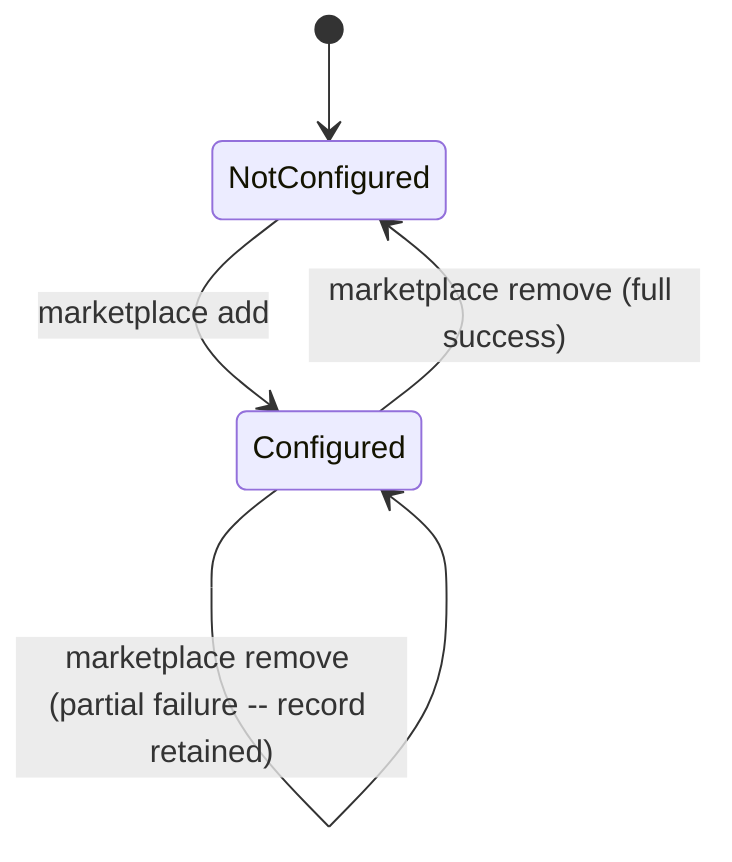

### 5.2 Plugin Lifecycle

#### 5.2.1 `install <plugin>@<marketplace> [--scope user|project] [--map-model]`

The `--map-model` flag is an opt-in for AG-7 model mapping. By default (when the flag is absent) the generated Pi agent `.md` files MUST OMIT the `model:` field entirely; Pi picks its own default model. When the user supplies `--map-model`, the AG-7 mapping table (see §5.7 AG-7 detail) applies and the generated `model:` is emitted byte-for-byte as before.

| ID        | Requirement                                                                                                                                                                                                                                                                                                                                                                                                                                                                                                                                                                                                                                                                                                                                                                                                                                                                                                                                                                                                                       |
| --------- | --------------------------------------------------------------------------------------------------------------------------------------------------------------------------------------------------------------------------------------------------------------------------------------------------------------------------------------------------------------------------------------------------------------------------------------------------------------------------------------------------------------------------------------------------------------------------------------------------------------------------------------------------------------------------------------------------------------------------------------------------------------------------------------------------------------------------------------------------------------------------------------------------------------------------------------------------------------------------------------------------------------------------------- |
| **PI-1**  | The token MUST be parsed as `<plugin>@<marketplace>` with exactly one `@`, both halves non-empty. Empty plugin half (`@mp`) and multiple `@` MUST be rejected.                                                                                                                                                                                                                                                                                                                                                                                                                                                                                                                                                                                                                                                                                                                                                                                                                                                                    |
| **PI-2**  | Resolution MUST consult the marketplace's already-cached manifest at `marketplaceRoot`. Install MUST NOT trigger a network sync (asymmetric with `update`, which does sync).                                                                                                                                                                                                                                                                                                                                                                                                                                                                                                                                                                                                                                                                                                                                                                                                                                                      |
| **PI-3**  | Plugins not present in the manifest MUST fail with `Plugin "<name>" not found in marketplace "<mp>".`                                                                                                                                                                                                                                                                                                                                                                                                                                                                                                                                                                                                                                                                                                                                                                                                                                                                                                                             |
| **PI-4**  | Plugins whose resolver result is non-installable MUST fail with `Plugin "<name>" is not installable: <notes>`.                                                                                                                                                                                                                                                                                                                                                                                                                                                                                                                                                                                                                                                                                                                                                                                                                                                                                                                    |
| **PI-5**  | Plugins already installed in this marketplace MUST fail with an "already installed" error.                                                                                                                                                                                                                                                                                                                                                                                                                                                                                                                                                                                                                                                                                                                                                                                                                                                                                                                                        |
| **PI-6**  | Cross-plugin name conflicts (skill, prompt, or agent generated names) MUST block install and list every conflicting name in one message.                                                                                                                                                                                                                                                                                                                                                                                                                                                                                                                                                                                                                                                                                                                                                                                                                                                                                          |
| **PI-7**  | The version recorded MUST come from (in order): the plugin manifest `version`, then the marketplace entry `version`, then a `hash-<12hex>` content hash of the plugin directory. ENOENT/ENOTDIR on the plugin dir during hashing MUST surface, not silently record `unknown`. The hash MUST be computed as SHA-256 over a recursive walk of the plugin directory: at each directory, sort entries by name; for each entry, hash the entry name followed by either the file contents (for files) or a recursive descent (for directories). File mtimes, permissions, ownership, and symlink targets MUST NOT be included. The hex digest MUST be truncated to its first 12 characters and prefixed with `hash-`. The 12-char truncation is a stable contract: changing it would silently invalidate every existing user's hash-versioned install record on next `update`. (12 hex chars ≈ 48 bits is well above the per-user collision threshold; for context, git's `core.abbrev=auto` lands around 10-12 chars on mature repos.) |
| **PI-8**  | Staging MUST happen in a tmp dir on the same filesystem as the destination; commit is an atomic rename. Staging dir leaks MUST surface as `cleanupWarnings` rather than block the install.                                                                                                                                                                                                                                                                                                                                                                                                                                                                                                                                                                                                                                                                                                                                                                                                                                        |
| **PI-9**  | Staging order MUST be: skills/prompts → agents → MCP servers → state commit. Failure at any later phase MUST roll back earlier phases and surface a single error containing `(rollback partial: …)` when any rollback step itself failed.                                                                                                                                                                                                                                                                                                                                                                                                                                                                                                                                                                                                                                                                                                                                                                                         |
| **PI-10** | `${CLAUDE_PLUGIN_ROOT}` and `${CLAUDE_PLUGIN_DATA}` MUST be substituted in skill bodies, command files, and agent bodies.                                                                                                                                                                                                                                                                                                                                                                                                                                                                                                                                                                                                                                                                                                                                                                                                                                                                                                         |
| **PI-11** | When ≥1 agent is staged and `pi-subagents` is unloaded, the message MUST include `pi-subagents is not loaded; install/load it and run /reload to make these agents available.`                                                                                                                                                                                                                                                                                                                                                                                                                                                                                                                                                                                                                                                                                                                                                                                                                                                    |
| **PI-12** | When ≥1 MCP server is staged and `pi-mcp-adapter` is unloaded, the message MUST include `pi-mcp-adapter is not loaded; install/load it (npm:pi-mcp-adapter) and run /reload to make these MCP servers available.`                                                                                                                                                                                                                                                                                                                                                                                                                                                                                                                                                                                                                                                                                                                                                                                                                 |
| **PI-13** | Plugins that declare `dependencies` MUST install with a warning: `This plugin declares dependencies that must be installed manually.`                                                                                                                                                                                                                                                                                                                                                                                                                                                                                                                                                                                                                                                                                                                                                                                                                                                                                             |
| **PI-14** | Path-containment violations (e.g., a component path that escapes the plugin root) MUST throw a `PathContainmentError` and MUST NOT be folded into the soft "rollback partial" line.                                                                                                                                                                                                                                                                                                                                                                                                                                                                                                                                                                                                                                                                                                                                                                                                                                               |
| **PI-15** | Concurrent install of the same plugin (detected at state-guard commit) MUST roll back staged resources and surface a "was installed concurrently" error.                                                                                                                                                                                                                                                                                                                                                                                                                                                                                                                                                                                                                                                                                                                                                                                                                                                                          |
| **PI-16** | The install target scope and the marketplace source scope are distinct per CMP-2..CMP-4: project-scope installs may use a project-scope marketplace or, if absent there, a user-scope marketplace; user-scope installs may only use user-scope marketplaces.                                                                                                                                                                                                                                                                                                                                                                                                                                                                                                                                                                                                                                                                                                                                                                      |
| **PI-17** | The same `<plugin>@<marketplace>` may be installed in both user and project target scopes. Already-installed checks and generated-resource conflict checks are scoped to the target scope only.                                                                                                                                                                                                                                                                                                                                                                                                                                                                                                                                                                                                                                                                                                                                                                                                                                   |

#### 5.2.2 `uninstall <plugin>@<marketplace> [--scope user|project]`

| ID       | Requirement                                                                                                                                                                                                                                                          |
| -------- | -------------------------------------------------------------------------------------------------------------------------------------------------------------------------------------------------------------------------------------------------------------------- |
| **PU-1** | Order of operations: remove recorded skills/prompts → unstage agents → unstage MCP servers → state-guard commit → clean per-plugin data dir.                                                                                                                         |
| **PU-2** | Per-plugin data dir cleanup happens AFTER state commit so an `EACCES` there cannot strand state in `installed=true`.                                                                                                                                                 |
| **PU-3** | Failures earlier than data-dir cleanup MUST cause the uninstall to abort with the marketplace record intact (retryable).                                                                                                                                             |
| **PU-4** | Data-dir cleanup leaks MUST surface at `warning` severity, with the leaked path named in the body.                                                                                                                                                                   |
| **PU-5** | Uninstall MUST tolerate concurrent uninstall by another process (silent converge if the record is already gone at commit time).                                                                                                                                      |
| **PU-6** | Legacy state records missing `resources.agents` or `resources.mcpServers` MUST be load-time-migrated to `[]`; uninstall MUST NOT crash on them.                                                                                                                      |
| **PU-7** | Foreign content at an agent target file (basename does not start with `pi-claude-marketplace-` or file is missing the generated marker) MUST cause that entry to be retained in the index with `failed[]` rather than silently kept. The uninstall MUST fail loudly. |
| **PU-8** | Uninstall MUST emit a reload hint (`Run /reload to drop "<plugin>"`) when any resource was removed.                                                                                                                                                                  |

#### 5.2.3 `update [<plugin>@<marketplace> | @<marketplace>] [--scope user|project] [--map-model]`

The `--map-model` flag is the same opt-in as on `install` (see §5.2.1). Without it, re-staged agents MUST OMIT the `model:` field. With it, the AG-7 mapping applies. The marketplace autoupdate cascade (`updateSinglePlugin`) does NOT accept this flag and always uses the omit-by-default behavior.

| ID        | Requirement                                                                                                                                                                                                                                                                                                                                              |
| --------- | -------------------------------------------------------------------------------------------------------------------------------------------------------------------------------------------------------------------------------------------------------------------------------------------------------------------------------------------------------- |
| **PUP-1** | Three forms: bare → every installed plugin in the chosen scope; `@mp` → every installed plugin in `mp`; `pl@mp` → just `pl`. When the resolved target set is empty (no plugins installed in the chosen scope; no plugins installed in `mp`), the command MUST succeed silently with the message `No plugins installed.` and MUST NOT emit a reload hint. |
| **PUP-2** | `update` MUST refresh the github clone (`syncClone`) for each marketplace once before reading the manifest. (This is asymmetric with `install`, which does not sync.)                                                                                                                                                                                    |
| **PUP-3** | If the resolved version equals the recorded version, the plugin MUST be reported `unchanged` (no I/O on disk artefacts).                                                                                                                                                                                                                                 |
| **PUP-4** | If the plugin is no longer installable per the resolver, the outcome MUST be `skipped` with `no longer installable: <notes>`.                                                                                                                                                                                                                            |
| **PUP-5** | If the plugin is missing from the refreshed manifest, the outcome MUST be `skipped: not in manifest`.                                                                                                                                                                                                                                                    |
| **PUP-6** | Update MUST be three phases: prepare (write to staging) → state-guard swap → physical replace + commit prepared agents/MCP. A failure in phase 3 (post-state) MUST surface a recovery hint pointing at `plugin-uninstall + plugin-install for "<name>".`                                                                                                 |
| **PUP-7** | On failure during phase 3, the staging dir MUST be cleaned up and the partially-prepared agents/MCP staging MUST be aborted; aborts must not mask the original error.                                                                                                                                                                                    |
| **PUP-8** | Reload hint MUST be emitted when at least one plugin was actually updated.                                                                                                                                                                                                                                                                               |
| **PUP-9** | A direct (non-cascade) `update` that throws at any phase MUST surface as an `error`-severity notification with the original cause chained via `Error.cause` (per ES-4). The `failed` partition (MU-7) is used only by cascade-mode updates that aggregate per-plugin outcomes.                                                                           |

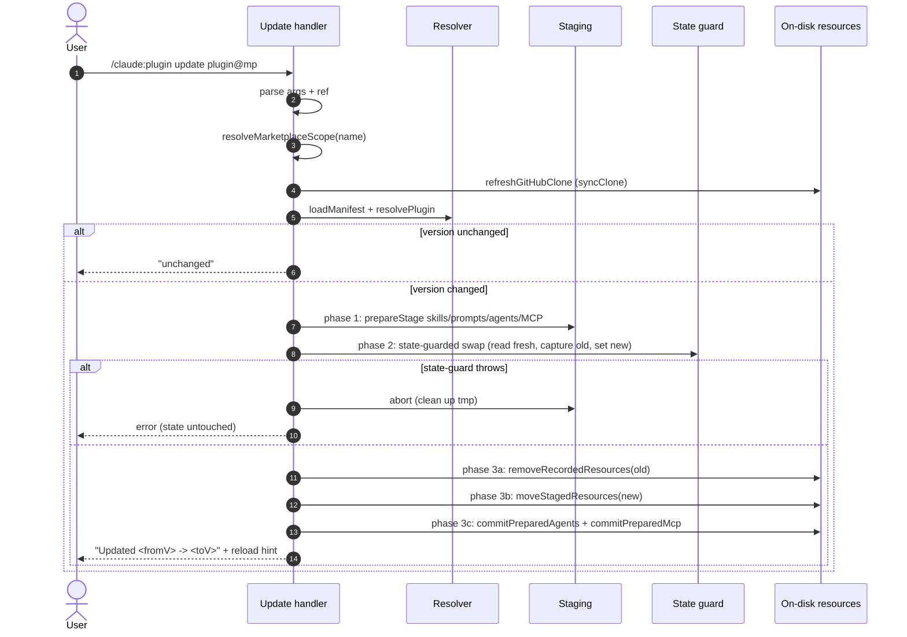

### 5.3 Listing & Inspection

#### 5.3.1 `list [<marketplace>] [--installed] [--available] [--unavailable] [--scope user|project]`

| ID       | Requirement                                                                                                                                                                                                                                                                                    |
| -------- | ---------------------------------------------------------------------------------------------------------------------------------------------------------------------------------------------------------------------------------------------------------------------------------------------- |
| **PL-1** | Without flags, every bucket (installed, available, unavailable) MUST be shown. With one or more `--installed/--available/--unavailable`, only those buckets MUST be shown (union).                                                                                                             |
| **PL-2** | Without a marketplace name, output MUST be a nested tree grouped by scope, with each marketplace as a section heading and plugins indented underneath.                                                                                                                                         |
| **PL-3** | With a marketplace name, only that marketplace's plugin list MUST be shown.                                                                                                                                                                                                                    |
| **PL-4** | Each plugin entry MUST show its icon (●/○/⊘), name, optional `(<version>)`, and a status marker `(installed)` / `(installed, upgradable)` / `(available)` / `(unavailable: <notes>)`. A description (when present) appears on a second indented line, truncated at column 66.                  |
| **PL-5** | A plugin is `upgradable` iff the manifest version differs (string compare) from the install record.                                                                                                                                                                                            |
| **PL-6** | If a marketplace's manifest fails to load (malformed JSON, missing file, etc.), the marketplace section MUST display `[warning] could not load manifest: <reason>` and the system MUST still render plugins recorded as installed in state -- installed plugins MUST never silently disappear. |
| **PL-7** | Per-marketplace headers in the nested tree MUST include the `[autoupdate]` tag when the flag is on.                                                                                                                                                                                            |

```mermaid
flowchart TD
  A[/claude:plugin list/] --> B{name given?}
  B -- no --> C[listVisibleMarketplaces]
  C --> D[for each: load manifest with fallback]
  D -- ok --> E[buildPluginListOutput<br/>installed/available/unavailable]
  D -- warning --> F[fallback to installed-from-state]
  E --> G[render nested tree]
  F --> G
  B -- yes --> H[find by name]
  H -- not found --> I[error: "Marketplace ... not found"]
  H -- found --> D
  G --> Z[ctx.ui.notify]
```

### 5.4 Autoupdate & Update Cascade

The two commands `marketplace update` and `update` interact:

| Trigger                                          | Manifest refresh                    | Plugin upgrade                             |
| ------------------------------------------------ | ----------------------------------- | ------------------------------------------ |
| `marketplace update <name>` (autoupdate **off**) | yes                                 | no                                         |
| `marketplace update <name>` (autoupdate **on**)  | yes                                 | yes (cascade)                              |
| `marketplace update` (bare, no name)             | yes for every marketplace           | per-marketplace cascade gated on each flag |
| `update` (bare or scoped)                        | **no** (uses cached manifest as-is) | yes                                        |

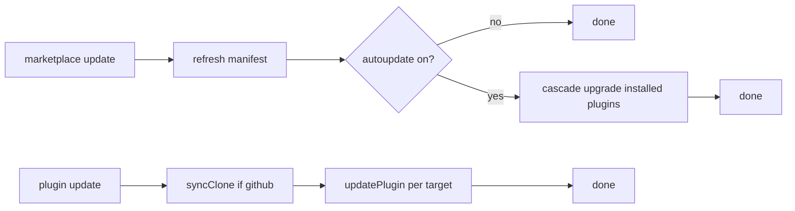

### 5.5 Skills Bridge (Pi resources)

| ID       | Requirement                                                                                                                                                                                                                                                                                 |
| -------- | ------------------------------------------------------------------------------------------------------------------------------------------------------------------------------------------------------------------------------------------------------------------------------------------- |
| **SK-1** | Skills MUST be staged as Pi skills under `<scope>/pi-claude-marketplace/resources/skills/<plugin>-<skill>/SKILL.md` (with the entire skill directory copied recursively).                                                                                                                   |
| **SK-2** | The generated skill name MUST be `<plugin>-<skill>`, with the `<plugin>-` prefix stripped from the source name when present. A source skill name equal to the plugin name becomes `<plugin>`. Skill names MUST satisfy Pi's skill-name validator: lowercase `a-z`, `0-9`, and hyphens only. |
| **SK-3** | The generated `SKILL.md` frontmatter MUST have its `name` field rewritten to the generated name (or added if missing). Other frontmatter MUST be preserved.                                                                                                                                 |
| **SK-4** | `${CLAUDE_PLUGIN_ROOT}` and `${CLAUDE_PLUGIN_DATA}` MUST be substituted inside `SKILL.md`.                                                                                                                                                                                                  |
| **SK-5** | `resources_discover` MUST report `skills/` directories from both scopes; per-scope failures MUST aggregate into a single thrown error rather than silently dropping the working scope.                                                                                                      |

### 5.6 Commands Bridge (Pi prompt templates)

| ID       | Requirement                                                                                                                  |
| -------- | ---------------------------------------------------------------------------------------------------------------------------- |
| **CM-1** | Commands MUST be staged as `<scope>/pi-claude-marketplace/resources/prompts/<plugin>:<command>.md`.                          |
| **CM-2** | Generated command name MUST be `<plugin>:<command>`, with the `<plugin>-` prefix stripped from the source name when present. |
| **CM-3** | Variable substitution (`${CLAUDE_PLUGIN_ROOT}`, `${CLAUDE_PLUGIN_DATA}`) MUST apply to command bodies.                       |
| **CM-4** | Discovery MUST treat flat `*.md` files only (non-recursive, ignore non-md).                                                  |

### 5.7 Agents Bridge (pi-subagents soft dependency)

| ID        | Requirement                                                                                                                                                                                                                                                                                                                               |
| --------- | ----------------------------------------------------------------------------------------------------------------------------------------------------------------------------------------------------------------------------------------------------------------------------------------------------------------------------------------- |
| **AG-1**  | Agent files MUST be staged at `<scope>/agents/pi-claude-marketplace-<plugin>-<agent>.md` (deliberately outside the extension's `resources/` because pi-subagents reads from a fixed convention path).                                                                                                                                     |
| **AG-2**  | An on-disk agent index `<extensionRoot>/agents-index.json` (schemaVersion 1) MUST track `(plugin, marketplace, sourceAgent, generatedName, sourcePath, targetPath, sourceHash, originalModel?, droppedFields, droppedTools, warnings)`.                                                                                                   |
| **AG-3**  | The index MUST be partitioned by `(marketplace, plugin)` so re-staging affects only entries owned by the current operation.                                                                                                                                                                                                               |
| **AG-4**  | Per-row index validation failures MUST soft-fail (drop the row, surface a "agent index corruption (entry dropped)" warning); file-level corruption MUST throw.                                                                                                                                                                            |
| **AG-5**  | Generated agent files MUST start with `pi-claude-marketplace-` (basename) AND contain the literal marker string `generated by pi-claude-marketplace` inside an HTML-comment provenance block placed immediately after the closing `---` of the frontmatter. Removal MUST refuse to touch any file failing either check (foreign content). |
| **AG-6**  | Source frontmatter MUST be parsed (line-based YAML; supports tolerating `:` in description values). Body is everything after the closing `---`.                                                                                                                                                                                           |
| **AG-7**  | Field mappings (see AG-7 detail below the table). Each frontmatter field MUST be translated according to the rules in §5.7 AG-7 detail.                                                                                                                                                                                                   |
| **AG-8**  | YAML emitter MUST be parser-safe (single quotes flipped if value already double-quoted; embedded newlines normalized to spaces; HTML-comment-style `-->` escaped).                                                                                                                                                                        |
| **AG-9**  | Cross-plugin name guard MUST refuse to overwrite agents owned by a different `(marketplace, plugin)` and report `"<name>" already owned by <other-mp>/<other-plugin>"`.                                                                                                                                                                   |
| **AG-10** | Staging is two-phase: write to a tmp dir under the extension's `agents-staging/`, then atomic rename + index save. The "noop" branch (no agents declared and no previous entries) MUST not materialize any directory.                                                                                                                     |
| **AG-11** | `convertAgent` MUST throw when the mapped tool list is empty (pi-subagents has no representation for "no tools"). The error message MUST list the source `tools:` and `disallowedTools:`.                                                                                                                                                 |
| **AG-12** | Source-name collisions within a single plugin MUST throw with both source names listed.                                                                                                                                                                                                                                                   |

#### AG-7 detail -- frontmatter field mappings

- `model:` -- OPT-IN via `--map-model` on `/claude:plugin install` and `/claude:plugin update`. **Default (no flag):** the generated agent frontmatter MUST OMIT `model:` entirely regardless of the source value; Pi picks its own default model and no `originalModel` provenance is recorded (absence is self-documenting). **With `--map-model`:** `sonnet` → `anthropic/claude-sonnet-4-6`, `opus` → `anthropic/claude-opus-4-7`, `haiku` → `anthropic/claude-haiku-4-5`. `inherit` → omit + record `originalModel`. Unknown → omit + warn. The marketplace autoupdate cascade (`updateSinglePlugin`) ALWAYS uses the omit-by-default behavior; the flag is install/update-only.
- `tools:` -- Map known Claude tools to Pi names per the table below. Unknown tools (e.g., `WebFetch`, `NotebookEdit`) are silently dropped. Missing `tools:` → default `read,bash,edit` with a warning.
  - `Read` → `read`
  - `Bash` → `bash`
  - `Edit` → `edit`
  - `Write` → `write`
  - `Grep` → `grep`
  - `Glob` → `find` (note: name change, not a 1:1 rename of the Pi tool)
  - `LS` → `ls`
- `disallowedTools:` -- Filtered out of the mapped list.
- `thinking:` / `effort:` -- Allowlist `off,minimal,low,medium,high,xhigh`. `thinking` wins; invalid → fall back to `effort` if valid; otherwise omit + warn.
- `skills:` -- Each token resolved as `<plugin>-<skill>`; unknown → drop + warn.
- `description:` -- Missing/empty → fallback `Imported Claude Code plugin agent <agent> from plugin <plugin>.` + warning.

### 5.8 MCP Servers Bridge (pi-mcp-adapter soft dependency)

| ID       | Requirement                                                                                                                                                                                                                                                                                                                                                                                                                                                     |
| -------- | --------------------------------------------------------------------------------------------------------------------------------------------------------------------------------------------------------------------------------------------------------------------------------------------------------------------------------------------------------------------------------------------------------------------------------------------------------------- |
| **MC-1** | The `mcpServers` declaration MUST be resolved with precedence: marketplace entry > plugin manifest > standalone `.mcp.json` at plugin root. First match wins; malformed at the matched source MUST throw (no fallthrough). Under `strict=false`, this precedence chain applies only when the marketplace entry itself declares `mcpServers`; manifest- or standalone-only declarations under `strict=false` are conflicts (per MM-7), not precedence fallbacks. |
| **MC-2** | A `.mcp.json` may use either the canonical unwrapped form (top-level entries) or the legacy wrapped form (`{ "mcpServers": { ... } }`). Both MUST parse.                                                                                                                                                                                                                                                                                                        |
| **MC-3** | A plugin whose only declaration is a malformed `mcpServers` MUST surface as **unavailable** with `malformed mcpServers: <reason>` -- silent fallthrough is not allowed.                                                                                                                                                                                                                                                                                         |
| **MC-4** | Server-name collisions MUST be checked across all four pi-mcp-adapter slots: `~/.config/mcp/mcp.json`, `<Pi agent dir>/mcp.json` (default `~/.pi/agent/mcp.json`, honoring `PI_CODING_AGENT_DIR`), `<cwd>/.mcp.json`, `<cwd>/.pi/mcp.json`. Self-replace within the same scope's mcp.json is allowed; foreign collisions MUST refuse stage.                                                                                                                     |
| **MC-5** | Each staged entry MUST carry a `_piClaudeMarketplace: { plugin, marketplace }` marker so uninstall/update drops only its own entries.                                                                                                                                                                                                                                                                                                                           |
| **MC-6** | Staging MUST be two-phase (compute next doc in memory; commit via atomic JSON write). The "noop" branch (no new servers AND no previous ours) MUST not materialize the file.                                                                                                                                                                                                                                                                                    |
| **MC-7** | Unstage MUST tolerate a missing `mcpServers` field (null/missing) without crashing.                                                                                                                                                                                                                                                                                                                                                                             |
| **MC-8** | An unloaded `pi-mcp-adapter` MUST NOT block install/update; the user-facing message MUST include the standard pi-mcp-adapter warning when servers were staged.                                                                                                                                                                                                                                                                                                  |

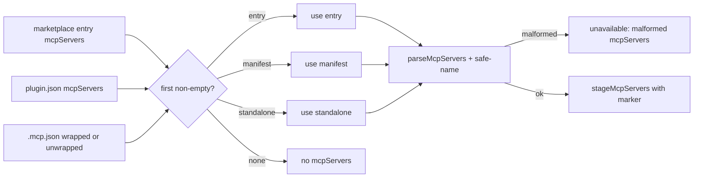

______________________________________________________________________

## 6. Functional Requirements -- Horizontal (Cross-cutting)

### 6.1 Source Parsing & Validation

| ID       | Requirement                                                                                                                                                             |
| -------- | ----------------------------------------------------------------------------------------------------------------------------------------------------------------------- |
| **SP-1** | The parser MUST accept these forms and only these forms (see SP-1 detail below the table).                                                                              |
| **SP-2** | The parser MUST reject `owner/repo@<ref>` with a hint pointing at `https://github.com/<owner/repo>#<ref>`.                                                              |
| **SP-3** | The parser MUST reject `git@…`, any other `://` URL, and `https://github.com/<owner/repo>/tree/<ref>` (with hint about `#<ref>`).                                       |
| **SP-4** | The parser MUST reject per-user tilde forms (`~user/foo`) with a clear error.                                                                                           |
| **SP-5** | Validation of `owner/repo` MUST require exactly one slash, both halves non-empty, no further segments. Empty fragment after `#` MUST be dropped (not left empty).       |
| **SP-6** | Source factory functions (`pathSource`, `githubSource`) MUST validate at every boundary that promotes an arbitrary string into a stored source -- including state-load. |
| **SP-7** | Tilde paths MUST be stored unchanged in `state.json`; `expandTildePath` is applied at access time.                                                                      |

#### SP-1 detail -- accepted source forms

- `owner/repo` (one slash, no `@`)
- `https://github.com/owner/repo[.git][#<ref>]`
- `https://github.com/owner/repo/` and `…/repo.git/` trailing-slash variants
- `https://github.com/owner/repo#` (empty fragment dropped)
- `~`, `~/...`, `./...`, `../...`, `/...`

### 6.2 Scopes & Resolution

| ID       | Requirement                                                                                                                                                                                                                                                                                                 |
| -------- | ----------------------------------------------------------------------------------------------------------------------------------------------------------------------------------------------------------------------------------------------------------------------------------------------------------- |
| **SC-1** | The system MUST support exactly two scopes: `user` (Pi agent dir, default `~/.pi/agent/`, honoring `PI_CODING_AGENT_DIR`) and `project` (`<cwd>/.pi/`). Claude Code's `local` scope MUST NOT be introduced unless Pi adds an equivalent.                                                                    |
| **SC-2** | All extension data lives at `<scopeRoot>/pi-claude-marketplace/`. Bridge files live at `<scopeRoot>/agents/` and `<scopeRoot>/mcp.json` (deliberately outside the extension's resources/).                                                                                                                  |
| **SC-3** | A `ScopedLocations` object MUST be a typed bundle that's the only way to derive on-disk paths for an operation; hand-crafted shapes that mix scopes MUST not type-check (brand symbol).                                                                                                                     |
| **SC-4** | Scope resolution rules for name-targeted commands. When `--scope` is provided, use that scope and error if the name is not found there. When `--scope` is omitted, search both scopes; if found in both, the project-scope record is used (project takes precedence, per CMP-5); error if found in neither. |
| **SC-5** | `marketplace add` defaults to `user` when scope is omitted.                                                                                                                                                                                                                                                 |
| **SC-6** | `marketplace list`, `marketplace update` (no name), `marketplace autoupdate` (no name), and `marketplace noautoupdate` (no name) MUST enumerate both scopes when `--scope` is omitted.                                                                                                                      |
| **SC-7** | Path containment MUST be enforced for every name-derived path: plugin data dirs, marketplace data dirs, source clone dirs, recorded skill/prompt paths, agent target paths.                                                                                                                                 |

#### 6.2.1 Scope-aware marketplace/plugin rules

These rules clarify how marketplace records and plugin install records interact across scopes:

| ID        | Requirement                                                                                                                                                                                                                                                                                                                                                                    |
| --------- | ------------------------------------------------------------------------------------------------------------------------------------------------------------------------------------------------------------------------------------------------------------------------------------------------------------------------------------------------------------------------------ |
| **CMP-1** | Marketplaces MAY be added independently to user scope, project scope, or both. Adding a duplicate name is forbidden only within the chosen scope (MA-8); the same marketplace name in the other scope is allowed.                                                                                                                                                              |
| **CMP-2** | Plugin lifecycle operations MUST distinguish target scope from source marketplace scope. The target scope is where plugin state and generated artefacts are written; the source marketplace scope is only where the marketplace manifest/source is read from.                                                                                                                  |
| **CMP-3** | For a project-target install, the marketplace is visible if it exists in project scope OR user scope. If both scopes contain that marketplace name, the project-scope marketplace record takes precedence as the source.                                                                                                                                                       |
| **CMP-4** | For a user-target install, the marketplace is visible only if it exists in user scope. A marketplace that exists only in project scope MUST NOT be used to install into user scope.                                                                                                                                                                                            |
| **CMP-5** | The same `<plugin>@<marketplace>` MAY be installed in both user and project target scopes. When an unqualified plugin lifecycle operation would otherwise match both installs, the project-scope install takes precedence; explicit `--scope user` or `--scope project` overrides this. Multi-target/list operations that intentionally enumerate both scopes still show both. |
| **CMP-6** | Completion MUST apply the same target-scope/source-marketplace visibility rules as execution. In particular, `install ... --scope project` completion may draw plugin names from a user-scope marketplace when no project-scope marketplace of that name exists.                                                                                                               |
| **CMP-7** | Install completion MUST suggest plugins that are **available** for the current target scope: present in a visible marketplace, resolver-installable, and not already installed in that target scope. Already-installed and unavailable plugins MUST NOT be suggested for install.                                                                                              |
| **CMP-8** | When project-target install completion sees the same marketplace name in both scopes, suggestions MUST be computed from the project-scope marketplace. When it falls back to a user-scope marketplace, the completed token remains `<plugin>@<marketplace>`; execution still writes the install to project scope.                                                              |

### 6.3 Manifest Schema & Strict Mode

| ID       | Requirement                                                                                                                                                                                                                                                              |
| -------- | ------------------------------------------------------------------------------------------------------------------------------------------------------------------------------------------------------------------------------------------------------------------------ |
| **MM-1** | `marketplace.json` MUST have a string `name`, an array `plugins`, optional boolean `strict`, optional `owner.name`. Other shapes throw a structural error.                                                                                                               |
| **MM-2** | Plugin entries MUST validate as objects with safe-name `name`, present `source` field, optional string `description`/`version`, optional component-path fields (string OR string[]), optional opaque unsupported-component declarations, optional opaque `dependencies`. |
| **MM-3** | `parsePluginSource` MUST classify into `path`/`github`/`url`/`git-subdir`/`npm` or `unknown`-with-reason. Only `path` is installable in V1; the rest are parsed and reported via resolver notes.                                                                         |
| **MM-4** | A non-relative string source (e.g., `foo/bar` without `./` or `../`) MUST become `{ kind: "unknown", reason: "non-relative string source ... }` rather than `{ kind: "github" }`.                                                                                        |
| **MM-5** | `strict=true` (default) -- resolver takes union of marketplace-entry, plugin-manifest, implicit-by-convention components (skills/, commands/, agents/ dirs), and standalone-file declarations (hooks/hooks.json, .mcp.json).                                             |
| **MM-6** | `strict=false` -- resolver uses marketplace-entry declarations only; plugin-manifest declarations of unsupported components OR convention-detected unsupported declarations MUST cause a "component declarations conflict" non-installable result.                       |
| **MM-7** | `strict=false`: a manifest/standalone `mcpServers` declaration without an entry-level declaration MUST also conflict.                                                                                                                                                    |

### 6.4 Plugin Compatibility Resolver

| ID       | Requirement                                                                                                                                                                                                                                                                                                                                                            |
| -------- | ---------------------------------------------------------------------------------------------------------------------------------------------------------------------------------------------------------------------------------------------------------------------------------------------------------------------------------------------------------------------- |
| **PR-1** | The resolver MUST return a discriminated union: `{ installable: true, pluginRoot, … }` or `{ installable: false, … }`; the latter MUST NOT expose `pluginRoot`.                                                                                                                                                                                                        |
| **PR-2** | The resolver MUST mark unavailable for any of: non-`path` source kind, source path escaping marketplace root, source directory missing on disk, malformed plugin manifest, declared unsupported components, malformed `mcpServers`, a component path that's not a non-empty string, a component path escaping the plugin root, an array-form supported-component path. |
| **PR-3** | An unsupported component name (e.g., hooks) MUST produce a note `contains <name>` and disqualify install.                                                                                                                                                                                                                                                              |
| **PR-4** | The resolver MUST detect implicit components by convention only when the corresponding manifest field is absent. The conventions are: supported component dirs (`skills/`, `commands/`, `agents/`); `hooks/hooks.json` (an unsupported `hooks` declaration); and `.mcp.json` (a supported `mcpServers` declaration).                                                   |
| **PR-5** | When `dependencies` are present, the resolver MUST add note `declares dependencies that must be installed manually` but MUST keep the plugin installable.                                                                                                                                                                                                              |
| **PR-6** | `requireInstallable` MUST narrow a `ResolvedPlugin` to its installable variant or throw `Plugin "<n>" is not installable: <notes>` (or `is no longer installable` for update).                                                                                                                                                                                         |

### 6.5 Resource Naming, Generation & Conflicts

| ID       | Requirement                                                                                                                                                                                                                                                                                                                                         |
| -------- | --------------------------------------------------------------------------------------------------------------------------------------------------------------------------------------------------------------------------------------------------------------------------------------------------------------------------------------------------- |
| **RN-1** | Generated names MUST be deterministic functions of `(plugin, source-name)`. Skill: `<plugin>-<skill>` (prefix elided). Command: `<plugin>:<command>` (prefix elided). Agent: `pi-claude-marketplace-<plugin>-<agent>` (with `<plugin>-` prefix on source elided).                                                                                   |
| **RN-2** | All names -- marketplace, plugin, skill, command, agent, MCP server -- MUST be `assertSafeName`: non-empty, trimmed, not `.`/`..`, no path separators, no control chars.                                                                                                                                                                            |
| **RN-3** | Cross-plugin install conflict guard MUST run BEFORE any disk write and MUST list every conflicting name in one message.                                                                                                                                                                                                                             |
| **RN-4** | Cross-marketplace agent ownership: re-staging an agent name owned by a different `(marketplace, plugin)` MUST throw with the conflicting owner identified.                                                                                                                                                                                          |
| **RN-5** | MCP server-name collisions MUST be checked against all four pi-mcp-adapter slots (see MC-4).                                                                                                                                                                                                                                                        |
| **RN-6** | Within a single plugin, two distinct skill source names that elide to the same generated skill name (e.g., a plugin `foo` with sources `foo-bar` and `bar`) MUST throw with both source names listed. The same rule applies to commands. A source name equal to the plugin name becomes skill `foo` and command `foo:foo`. (For agents, see AG-12.) |

### 6.6 Tab Completion

| ID       | Requirement                                                                                                                                                                                                                                                                        |
| -------- | ---------------------------------------------------------------------------------------------------------------------------------------------------------------------------------------------------------------------------------------------------------------------------------- |
| **TC-1** | The first positional after `/claude:plugin` MUST surface `install / uninstall / update / list / marketplace`.                                                                                                                                                                      |
| **TC-2** | After the `marketplace` keyword, completion MUST surface `add / remove / list / update / autoupdate / noautoupdate` (and `rm` is accepted but not surfaced).                                                                                                                       |
| **TC-3** | Whenever the cursor sits at a token starting with `-` (single OR double dash), completion MUST surface `--scope` plus, for `list`, `--installed / --available / --unavailable`. Single-dash and double-dash MUST behave identically (Pi has no short flags).                       |
| **TC-4** | The token immediately following `--scope` MUST surface `user` and `project` only.                                                                                                                                                                                                  |
| **TC-5** | For `list <here>` and `marketplace <remove\|rm\|update\|autoupdate\|noautoupdate> <here>`, completion MUST list the union of marketplace names from both scopes.                                                                                                                   |
| **TC-6** | For `install / uninstall / update <here>`, completion MUST emit `<plugin>@<marketplace>` tokens (see TC-6 detail below the table). `install` completion MUST be available-only per CMP-6..CMP-8.                                                                                   |
| **TC-7** | All terminal completions MUST include a trailing space so the next argument can be typed without a manual space. The system MUST also collapse a "double space" caused when text already follows the cursor (fish-style normalization), scoped to lines invoking `/claude:plugin`. |
| **TC-8** | Manifest-load failures during plugin completion for one marketplace MUST NOT blank completion for the others (per-marketplace soft-fail to empty set).                                                                                                                             |
| **TC-9** | Top-level `state.json` errors during completion MUST propagate (don't hide a corrupt state behind "no completions").                                                                                                                                                               |

#### TC-6 detail -- `<plugin>@<marketplace>` token rules

- Plugins unique to one marketplace produce a fully-qualified `name@mp` suggestion (with trailing space).
- Plugins present in multiple marketplaces produce `name@` (no trailing space) so the user picks a marketplace next.
- For `install`, candidate plugins are available-only for the current target scope (CMP-7). With no `--scope`, the target scope is `user`; with `--scope project`, candidates may come from project marketplaces or user marketplaces according to CMP-3/CMP-8.
- For `uninstall` and `update`, candidates come from installed plugins. If a plugin is installed in both user and project target scopes and `--scope` is omitted, the project-scope install is the completion target (CMP-5); explicit `--scope` overrides.
- `update` (only) MUST also accept `@<marketplace>` for the marketplace-only target.

### 6.7 Argument Parsing

| ID       | Requirement                                                                                                                 |
| -------- | --------------------------------------------------------------------------------------------------------------------------- |
| **AP-1** | Tokenization MUST honor single and double quotes for arguments containing spaces.                                           |
| **AP-2** | `--scope` MUST require exactly `user` or `project` as its value; missing value or any other value MUST raise a clear error. |
| **AP-3** | Subcommand routing MUST surface a `Usage:` block on empty/unknown input (top-level and `marketplace`-nested).               |
| **AP-4** | `--scope` MUST be accepted at any position in the arg list; positionals are extracted in order.                             |

### 6.8 Reload Hint & Soft-Dependency Probing

| ID       | Requirement                                                                                                                                                                                                                        |
| -------- | ---------------------------------------------------------------------------------------------------------------------------------------------------------------------------------------------------------------------------------- |
| **RH-1** | A reload hint MUST be emitted ONLY when generated resources changed. Operations that change nothing (e.g., `marketplace add` to a brand-new marketplace, `update` with everything `unchanged`) MUST NOT emit one.                  |
| **RH-2** | The hint format. For a single name: `Run /reload to <verb> it.` For N names: `Run /reload to <verb> "n1", "n2", ...".` Verbs: `load` (install), `refresh` (update / cascade), `drop` (uninstall, remove).                          |
| **RH-3** | `pi-subagents` detection MUST probe for a tool named `subagent` in `pi.getAllTools()`.                                                                                                                                             |
| **RH-4** | `pi-mcp-adapter` detection MUST match any of: tool name `mcp` (proxy mode), or any tool whose `sourceInfo.source` substring-matches `pi-mcp-adapter` (covers `npm:pi-mcp-adapter`, `github:.../pi-mcp-adapter`, local-path forms). |
| **RH-5** | When the soft dep is unloaded AND staged resources of that kind exist, the success message MUST include the canonical `<name> is not loaded; install/load it … and run /reload` warning line BEFORE the trailing reload hint.      |

### 6.9 State Persistence, Migration & Concurrency

| ID       | Requirement                                                                                                                                                                                                                                      |
| -------- | ------------------------------------------------------------------------------------------------------------------------------------------------------------------------------------------------------------------------------------------------ |
| **ST-1** | State MUST live at `<extensionRoot>/state.json` with `schemaVersion: 1`. Save MUST be atomic (tmp + rename).                                                                                                                                     |
| **ST-2** | Per-marketplace records MUST carry: name, scope, source, addedFromCwd, manifestPath, marketplaceRoot, optional lastUpdatedAt, optional autoupdate, plugins map.                                                                                  |
| **ST-3** | Per-plugin install records MUST carry: version, `resolvedSource` (an absolute filesystem path string; always absolute, no kind discriminator), compatibility, resources (skills, prompts, agents, mcpServers), installedAt, updatedAt.           |
| **ST-4** | Legacy records missing `manifestPath`/`marketplaceRoot` MUST be load-time-migrated by deriving them from `(source, addedFromCwd, name, extensionRoot)` and persisted asynchronously (best-effort save; warns on failure but doesn't block read). |
| **ST-5** | Legacy plugin records missing `resources.agents` or `resources.mcpServers` MUST be load-time-normalized to `[]`.                                                                                                                                 |
| **ST-6** | Source-record validation MUST funnel through the same factory as parse-time validation, so corrupt state is caught at load.                                                                                                                      |
| **ST-7** | All mutating operations MUST run inside `withStateGuard`, which re-loads fresh state on entry, hands the closure a mutable copy, saves only if the closure does not throw, and returns whatever the closure returns.                             |
| **ST-8** | Concurrent install/uninstall MUST be detected at commit time and treated as either a soft-converge (uninstall: record already gone → skip delete) or hard-fail-with-rollback (install: record now present → roll back).                          |
| **ST-9** | Update MUST detect concurrent change at commit (`installed=false` or `version !== fromVersion`) and abort with `changed concurrently; retry the update.`                                                                                         |

### 6.10 Path Safety & Containment

| ID       | Requirement                                                                                                                                           |
| -------- | ----------------------------------------------------------------------------------------------------------------------------------------------------- |
| **PS-1** | Every name-derived path MUST be path.resolve'd and checked with `assertPathInside(parent, child)`. Violations throw `PathContainmentError`.           |
| **PS-2** | Plugin source paths MUST be relative; absolute paths in `source.path` (string-form) MUST be rejected by the resolver as unavailable.                  |
| **PS-3** | Component paths in `plugin.json` and `marketplace.json` MUST be relative; absolute paths produce a resolver note and disqualify install.              |
| **PS-4** | Containment violations during rollback MUST propagate (state corruption is loud), NOT be folded into a soft "rollback partial" line.                  |
| **PS-5** | Generated agent files MUST be inside `locations.agentsDir`; agent-staging tmp files inside `locations.agentsStagingDir`; both checked at every write. |

### 6.11 Atomic Staging, Commit & Rollback

| ID       | Requirement                                                                                                                                                                                                                                                                                                             |
| -------- | ----------------------------------------------------------------------------------------------------------------------------------------------------------------------------------------------------------------------------------------------------------------------------------------------------------------------- |
| **AS-1** | All disk-write phases MUST stage to a tmp dir on the same filesystem as the destination, then atomic-rename.                                                                                                                                                                                                            |
| **AS-2** | Install ordering MUST be: skills/prompts → agents → MCP servers → state commit.                                                                                                                                                                                                                                         |
| **AS-3** | Update MUST be three-phase: prepare in tmp → state-guard swap (with old-resource snapshot) → physical replace + soft-dep commit.                                                                                                                                                                                        |
| **AS-4** | Rollback MUST collect failures from each phase (`skills/prompts`, `agents`, `mcpServers`, `data dir`) into a single `(rollback partial: [phase] msg; …)` summary on the thrown error.                                                                                                                                   |
| **AS-5** | Cleanup leaks MUST be appended to errors via `appendLeaks`/`appendLeakToError` so a leak doesn't mask the original cause.                                                                                                                                                                                               |
| **AS-6** | Post-commit cleanup leaks (e.g., uninstall data-dir rm failure) MUST surface as `cleanupWarnings` and bump message severity to `warning`. The state MUST already be committed.                                                                                                                                          |
| **AS-7** | Specific guidance MUST be emitted when an install rollback leaves orphan agent index entries. When the whole-plugin index is unreadable: `MANUAL RECOVERY REQUIRED: agent index could not be loaded …`. When specific entries are orphaned: `MANUAL RECOVERY REQUIRED: one or more agent files could not be removed …`. |
| **AS-8** | An empty `mcpServers` map combined with no previous-ours entries MUST NOT materialize `mcp.json`.                                                                                                                                                                                                                       |
| **AS-9** | An empty agents source dir AND no previous-ours entries MUST NOT materialize the scoped agents dir or the index file.                                                                                                                                                                                                   |

### 6.12 Error Surfaces & Severity

| ID       | Requirement                                                                                                                                                                                                                                                         |
| -------- | ------------------------------------------------------------------------------------------------------------------------------------------------------------------------------------------------------------------------------------------------------------------- |
| **ES-1** | All user-visible failure modes MUST go through `ctx.ui.notify(message, severity)`.                                                                                                                                                                                  |
| **ES-2** | `severity` choices. Default (success): operation fully succeeded. `warning`: operation succeeded but produced cleanup leaks, partial failures, soft-dep warnings, or cascade skips/fails. `error`: operation did not succeed; state unchanged or fully rolled back. |
| **ES-3** | Usage errors (malformed args, unknown subcommand, missing required positional) MUST surface at `error` severity with the relevant Usage block appended.                                                                                                             |
| **ES-4** | Errors MUST include the original cause via `Error.cause` chain; `formatErrorWithCauses` MUST flatten the chain (bounded depth 5) for cascade reporting.                                                                                                             |
| **ES-5** | Specific marker strings MUST remain stable as user contract (gitlint-grade strings): `pi-subagents is not loaded; …`; `pi-mcp-adapter is not loaded; …`; `Run /reload to <verb> …`; `MANUAL RECOVERY REQUIRED: …`; `(rollback partial: [<phase>] <msg>; …)`.        |

### 6.13 Internationalization, Logging & Telemetry

| ID       | Requirement                                                                                                                                                                                                                                                                                                                      |
| -------- | -------------------------------------------------------------------------------------------------------------------------------------------------------------------------------------------------------------------------------------------------------------------------------------------------------------------------------- |
| **IL-1** | All user-visible messages MUST be English-only in V1; no message catalog, no locale negotiation.                                                                                                                                                                                                                                 |
| **IL-2** | Every user-visible message MUST be delivered through `ctx.ui.notify(message, severity)` (see ES-1). Direct writes to `process.stdout`/`process.stderr` are forbidden in command and bridge code.                                                                                                                                 |
| **IL-3** | The single sanctioned use of `console.warn` is the load-time `state.json` migration save: when `migrateLegacyMarketplaceRecords` rewrites a legacy record and the best-effort save fails, the failure MUST be reported via `console.warn` (so a read can proceed) rather than thrown. No other code path may use `console.warn`. |
| **IL-4** | V1 MUST NOT emit telemetry (no metrics, no event sink, no analytics endpoint). Adding telemetry is a successor-architecture concern.                                                                                                                                                                                             |
| **IL-5** | The successor architecture should consider: a pluggable message catalog for i18n; a structured event channel for `success` / `warning` / `error` / `cleanup-leak` / `rollback`; and severity-aware log levels separate from the user-facing notify channel.                                                                      |

______________________________________________________________________

## 7. User Journeys

### 7.1 First-time install (happy path)

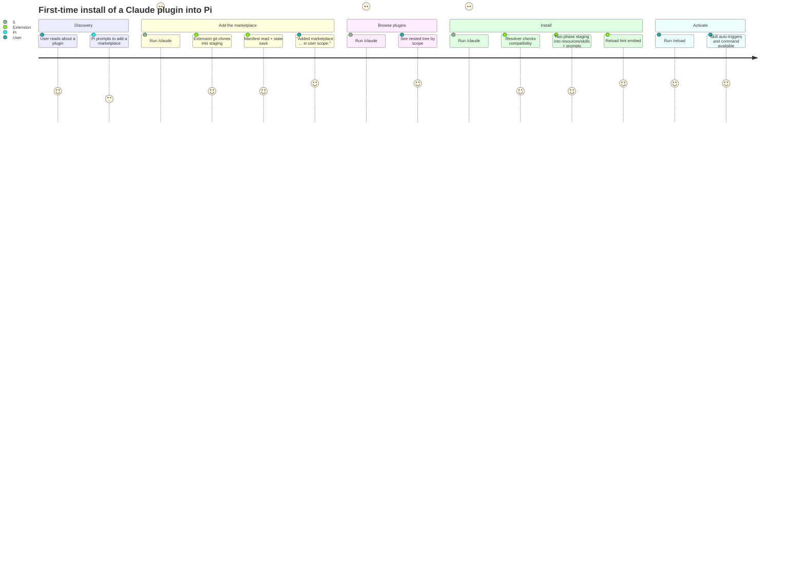

### 7.2 Plugin with agents and MCP servers, soft-deps unloaded (degraded path)

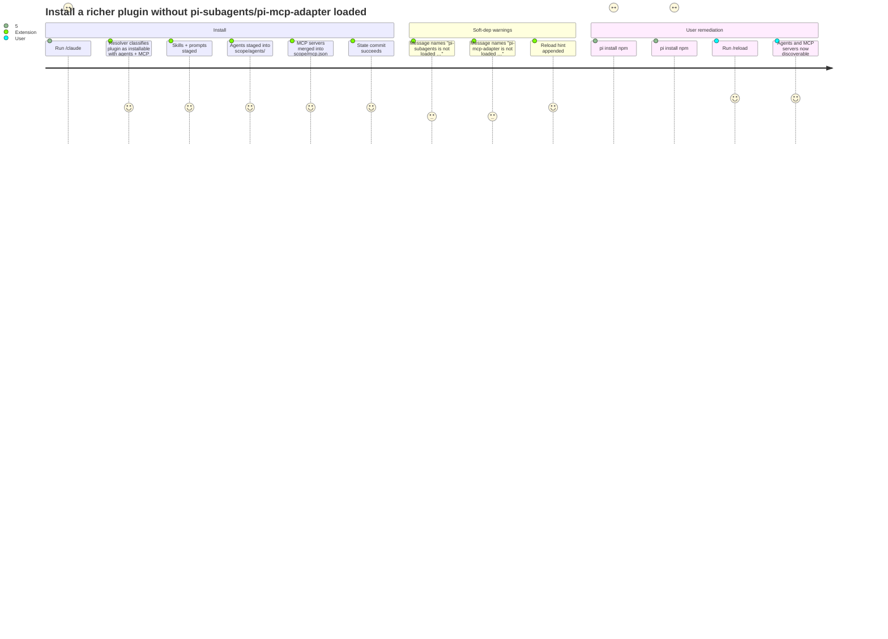

### 7.3 GitHub source -- non-fast-forward divergence (unhappy path, recovery)

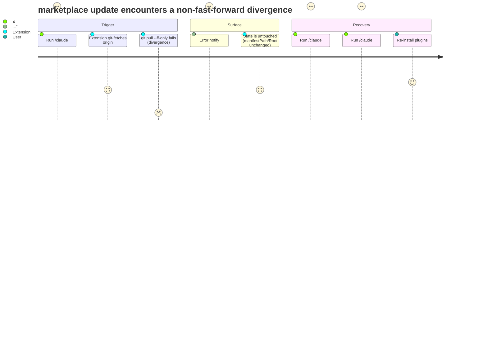

### 7.4 Plugin removal with locked data dir (warning, retryable)

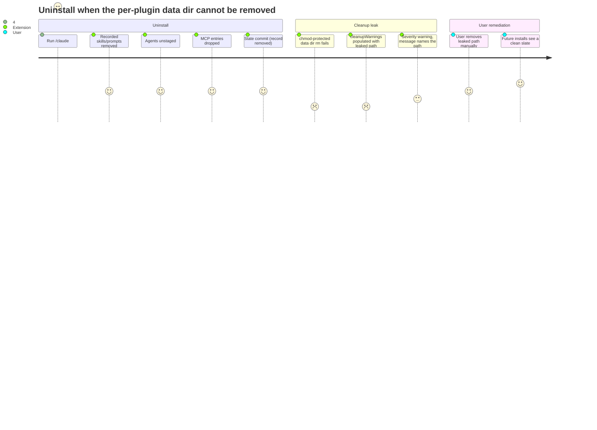

### 7.5 Concurrent install converges via state-guard (race recovery)

```mermaid
journey
  title Two install invocations race on the same plugin
  section Both invocations begin
    Process A reads state (plugin not installed): 4: User
    Process B reads state (plugin not installed): 4: User
  section A wins the commit
    A stages skills, agents, MCP: 4: Extension
    A enters state-guard, re-reads state, sees no record, saves NEW: 5: Extension
    A emits Run /reload to load it.: 5: User
  section B detects the race at commit
    B stages skills, agents, MCP: 4: Extension
    B enters state-guard, re-reads state, sees A's record: 3: Extension
    B detects concurrent install (PI-15), rolls back staged resources: 3: Extension
    B reports plugin "X" was installed by another process; retry if needed.: 3: User
  section No corruption
    State has exactly one install record: 5: User
    Disk has exactly one set of staged resources: 5: User
```

### 7.6 Marketplace remove with unloaded soft-deps (warning surfaces, hint emitted)

```mermaid
journey
  title Remove a marketplace whose plugins staged agents and MCP servers when pi-mcp-adapter is unloaded
  section Setup
    Marketplace mp has plugin pl with agents and MCP entries: 4: User
    pi-mcp-adapter is not loaded in this Pi session: 3: User
  section Remove
    Run /claude:plugin marketplace remove mp: 4: User
    Cascade unstages agents (pi-subagents loaded; succeeds): 4: Extension
    Cascade unstages MCP entries (writes scoped mcp.json directly): 4: Extension
    State commit drops the marketplace record: 5: Extension
  section Surfaced messaging
    Success line: Removed marketplace mp: 5: User
    Soft-dep warning per RH-5: pi-mcp-adapter is not loaded; install/load it ... and run /reload: 3: User
    Reload hint per MR-8: Run /reload to drop "pl".: 4: User
  section Followup
    User loads pi-mcp-adapter and runs /reload: 5: User
    Stale MCP entries pruned at next mcp.json read: 5: Extension
```

______________________________________________________________________

## 8. State Diagrams

### 8.1 Per-plugin state

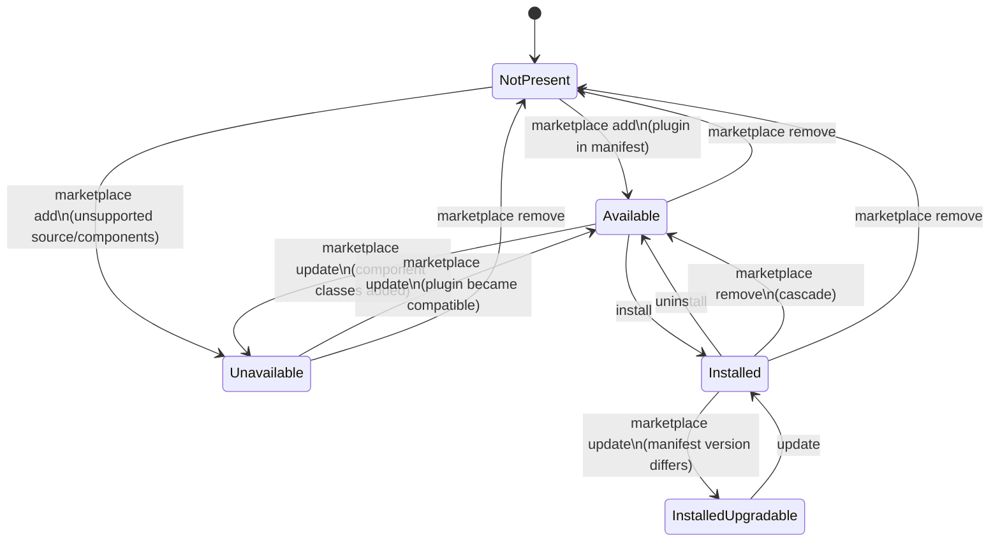

### 8.2 Per-marketplace state

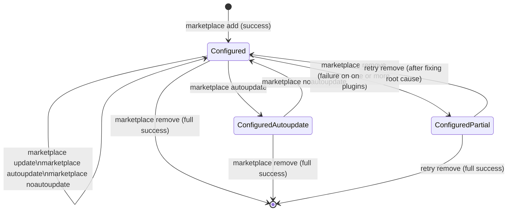

### 8.3 Install transaction

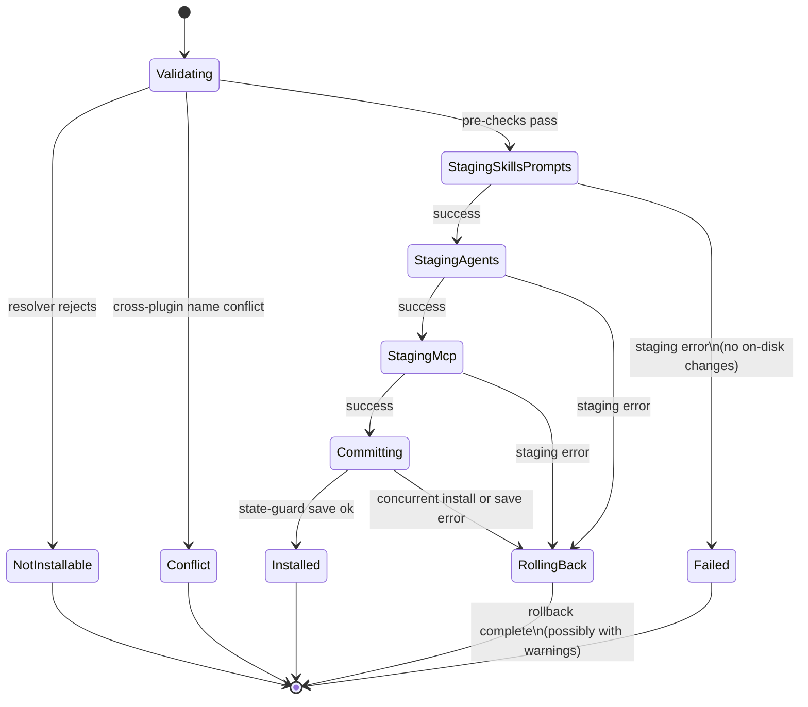

### 8.4 Update transaction (3-phase)

```mermaid
stateDiagram-v2
  [*] --> Refreshing
  Refreshing --> ResolvingTarget : syncClone (github) or noop (path)
  ResolvingTarget --> NoChange : toVersion == fromVersion
  ResolvingTarget --> Preparing : version differs
  Preparing --> SwappingState : staging tmp ok
  Preparing --> AbortStaging : staging error\n(rollback partial: ...)
  SwappingState --> ReplacingDisk : state-guard saves NEW
  SwappingState --> AbortConcurrent : concurrent change\n(changed concurrently; retry the update)
  ReplacingDisk --> Committing : old removed, new in place
  ReplacingDisk --> RecoveryRequired : phase 3 error\n(state already NEW)
  Committing --> Updated : agents/MCP committed
  Committing --> RecoveryRequired : commit error
  AbortStaging --> [*]
  AbortConcurrent --> [*]
  RecoveryRequired --> [*] : message advises\nuninstall + install
  NoChange --> [*]
  Updated --> [*]
```

______________________________________________________________________

## 9. Architecture Diagrams

### 9.1 Extension module layout (V1)

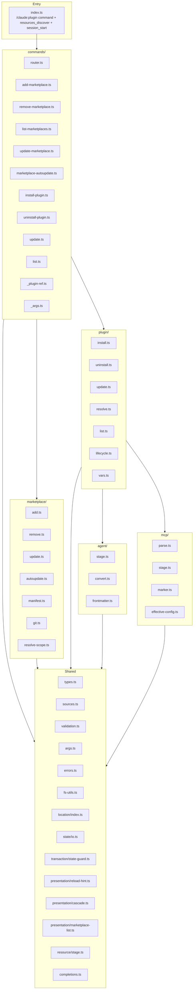

### 9.2 Persistence layout per scope

```text
<scopeRoot>/                          # Pi agent dir (user; defaults to ~/.pi/agent) or <cwd>/.pi (project)
├── pi-claude-marketplace/               # extensionRoot
│   ├── state.json                    # marketplaces + plugins
│   ├── agents-index.json             # generated-agent index
│   ├── agents-staging/               # tmp dir for in-flight agent staging
│   ├── staging/                      # tmp dir for skills/prompts staging
│   ├── data/<marketplace>/<plugin>/  # ${CLAUDE_PLUGIN_DATA}
│   ├── sources/<marketplace>/        # github clones (path sources don't touch)
│   └── resources/
│       ├── skills/<plugin>-<skill>/SKILL.md
│       └── prompts/<plugin>:<command>.md
├── agents/                           # pi-subagents reads here (NOT extensionRoot)
│   └── pi-claude-marketplace-<plugin>-<agent>.md
└── mcp.json                          # pi-mcp-adapter reads here (NOT extensionRoot)
```

### 9.3 Soft-dependency probing

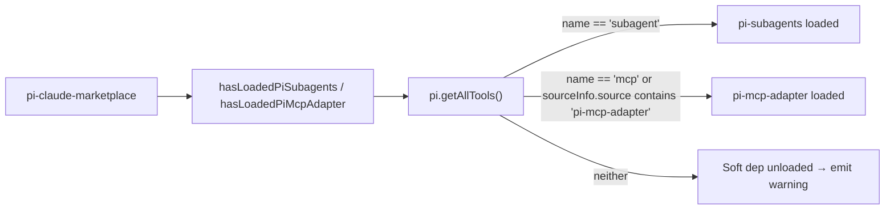

______________________________________________________________________

## 10. Non-functional Requirements

| ID         | Requirement                                                                                                                                                                                                                                                                                                                           |
| ---------- | ------------------------------------------------------------------------------------------------------------------------------------------------------------------------------------------------------------------------------------------------------------------------------------------------------------------------------------- |
| **NFR-1**  | All disk mutations MUST be atomic at the file level (tmp + rename or atomic JSON write).                                                                                                                                                                                                                                              |
| **NFR-2**  | No fix should require an `pi` restart; `Run /reload` MUST suffice to make staged resources discoverable.                                                                                                                                                                                                                              |
| **NFR-3**  | All operations MUST be safe to retry on transient failure (idempotent or fail-clean).                                                                                                                                                                                                                                                 |
| **NFR-4**  | The extension MUST work with Node ≥ 22.                                                                                                                                                                                                                                                                                               |
| **NFR-5**  | The extension MUST not require network access for `install`, `list`, `uninstall`, `marketplace remove`, or `marketplace add` against a path source. Network access is required for `marketplace add` to a GitHub source and for `update` / `marketplace update` against GitHub-source marketplaces.                                   |
| **NFR-6**  | The full quality bar is `npm run check` = typecheck + ESLint + Prettier + tests. The successor MUST keep these gates.                                                                                                                                                                                                                 |
| **NFR-7**  | The TypeScript surface MUST use `strictly typed` resolved-plugin variants -- installable consumers do not get to read `pluginRoot` from a non-installable plugin.                                                                                                                                                                     |
| **NFR-8**  | The successor SHOULD cache marketplace manifests with mtime invalidation to remove the per-`list` re-read cost (BACKLOG performance item).                                                                                                                                                                                            |
| **NFR-9**  | The system MUST never print sensitive paths beyond what's already in the user's terminal session.                                                                                                                                                                                                                                     |
| **NFR-10** | The system MUST refuse to write outside `<scopeRoot>/pi-claude-marketplace/`, `<scopeRoot>/agents/`, or `<scopeRoot>/mcp.json` for any reason.                                                                                                                                                                                        |
| **NFR-11** | The Pi extension API dependency is declared as `@mariozechner/pi-coding-agent` peer dependency with no version pin (`*`); the extension is developed against `^0.70.6`. The successor SHOULD pin a minimum supported Pi API version once the surface stabilizes.                                                                      |
| **NFR-12** | The Claude `marketplace.json` parser is forward-compatible: it does not check or assume any schema version field. Unknown plugin source kinds parse to `{ kind: "unknown", reason }` rather than failing. The parser targets the de-facto schema observable in `anthropics/claude-plugins-official` as of the V1 implementation date. |

______________________________________________________________________

## 11. Out of Scope (V1)

These items are documented in `BACKLOG.md` and intentionally deferred from V1 to keep the surface manageable:

- **Components beyond skills/commands/agents/mcpServers** -- hooks, lspServers, monitors, themes, output styles, channels, userConfig, bin, settings (each integrated through dedicated Pi extensions where appropriate).
- **Plugin sources beyond local paths** -- github / git / git-subdir / npm object sources surface as unavailable.
- **Marketplace source kinds beyond GitHub + local** -- SSH URLs, arbitrary HTTPS git URLs, remote `marketplace.json` URLs, sparse checkout, browser-paste tree URLs.
- **Claude `local` scope** (no Pi equivalent).
- **Managed/allowlist/blocklist policies** (no Pi equivalent).
- **Automatic dependency resolution / pruning** -- manual-install warning only.
- **Custom component-path arrays as supplemental** -- currently the explicit declaration replaces the default rather than supplementing it. Spec says it should supplement.
- **Performance: manifest caching with mtime invalidation.**
- **Rich interactive marketplace/plugin selectors.**
- **JSON output / dry-run modes for install/update/uninstall.**
- **Session-start autoupdate run** (Claude Code parity).
- **`info` subcommand** for plugins/marketplaces.
- **`--force` install with `incomplete` state** for partially-supported plugins.
- **Mutating LLM tools** for install/update/remove.

______________________________________________________________________

## 12. Acceptance Criteria Summary

The V1 implementation has unit and integration tests covering the requirements above; each requirement traces to at least one named test. Representative examples by area:

| Area               | Representative tests (excerpts)                                                                                                                                                                                                                                                                                                                                                                                                                           |
| ------------------ | --------------------------------------------------------------------------------------------------------------------------------------------------------------------------------------------------------------------------------------------------------------------------------------------------------------------------------------------------------------------------------------------------------------------------------------------------------- |
| Source parsing     | "owner/repo parses as github source"; "owner/repo@v1 throws and points users at the URL form"; "`https://github.com/owner/repo/tree/main` throws with hint about `#<ref>`"; "~user/foo throws"; "SSH URL throws not supported yet"                                                                                                                                                                                                                        |
| Add marketplace    | "addMarketplace adds a record from fixture manifest"; "addMarketplace clones a github source into sourceCloneDir and writes state"; "addMarketplace cleans up staging when the manifest is missing in the clone"; "addMarketplace rejects when sourceCloneDir already exists from a prior crash"                                                                                                                                                          |
| Remove marketplace | "removeMarketplace deletes marketplace and its installed plugin records"; "removeMarketplace converges state even when a plugin's resources can't be cleaned"; "removeMarketplace retains the github source clone dir when a plugin cleanup fails"                                                                                                                                                                                                        |
| Update cascade     | "update cascade re-stages installed plugins whose version bumped"; "update cascade marks plugins that became uninstallable as skipped"; "update cascade does not auto-install new plugins"; "updateMarketplace skips plugin cascade when autoupdate flag is off"                                                                                                                                                                                          |
| Plugin install     | "install compatible plugin writes staged resources"; "project-scope install can use a user-scope marketplace when absent in project scope"; "user-scope install rejects a project-only marketplace"; "same plugin can be installed in both scopes"; "same-scope resource conflict blocks install"; "install agent-collision plugin throws and leaves state empty"; "install rollback removes a pre-existing per-plugin data dir on agent-staging failure" |
| Plugin update      | "update no-ops when resolved version matches installed version"; "update phase-3 cleanup failure surfaces the …" recovery message; "update agent-only re-stages agents on version bump"; "update mcp-only: empty new mcpServers map clears previously staged entries"                                                                                                                                                                                     |
| Plugin uninstall   | "uninstall removes only resources recorded for that plugin"; "uninstall plugin record without resources.agents does not crash (legacy state)"; "uninstall tolerates a concurrent uninstall by another process"                                                                                                                                                                                                                                            |
| Strict mode        | "strict=true: implicit skills/ directory is detected"; "strict=false: implicit directories are ignored"; "strict=false with conflicting plugin manifest component declarations is not installable"; "strict=true: standalone .mcp.json at plugin root makes plugin installable"                                                                                                                                                                           |
| Agent conversion   | "convertAgent: missing tools defaults to read,bash,edit"; "convertAgent: all tools disallowed throws"; "convertAgent: invalid thinking + valid effort falls back to effort with warning"; "stagePluginAgents: refuses to overwrite a foreign plugin's content"                                                                                                                                                                                            |
| MCP bridge         | "stageMcpServers: writes entries with marker"; "stageMcpServers: refuses when name already exists in scope file"; "unstageMcpServers: leaves user-owned entries untouched"; "resolvePluginMcpServers: marketplace-entry wins over manifest"; "resolvePlugin: .mcp.json wrapped form is parsed when convention file uses {mcpServers: {...}}"                                                                                                              |
| Soft-dep probing   | "hasLoadedPiSubagents: returns true when subagent tool is registered"; "hasLoadedPiMcpAdapter: matches npm install spec"; "install handler emits pi-subagents warning when agents staged and subagent tool is absent"                                                                                                                                                                                                                                     |
| Tab completion     | "getArgumentCompletions: single dash surfaces the same flags as double dash"; "normalizeCompletionWhitespace collapses run after the inserted trailing space"; "install completion suggests only plugins available in the current target scope"; "install --scope project completion can source plugins from user-scope marketplaces"; "getPluginRefCompletions: installed mode returns full plugin@marketplace when name is unique"                      |
| Listing            | "renderNestedMarketplaceList includes [autoupdate] tag when flag is on"; "unloadable manifest emits [warning] and still renders installed plugins"; "installed plugin is upgradable when manifest version differs from record version"                                                                                                                                                                                                                    |
| State & migration  | "state defaults and round trips"; "loadState carries autoupdate flag through a save/load round trip"; "uninstall plugin record without resources.mcpServers does not crash (legacy state)"                                                                                                                                                                                                                                                                |
| Concurrency        | "withStateGuard sees writes that landed between caller's read and the closure"; "uninstall tolerates a concurrent uninstall by another process"; "update rejects when the marketplace record disappears between phases"                                                                                                                                                                                                                                   |
| End-to-end         | "anthropics/claude-plugins-official: install + uninstall every supported plugin" (live integration test)                                                                                                                                                                                                                                                                                                                                                  |

______________________________________________________________________

### Appendix A: Subcommand index

```text
/claude:plugin
├── install      <plugin>@<marketplace>            [--scope user|project] [--map-model]
├── uninstall    <plugin>@<marketplace>            [--scope user|project]
├── update       [<plugin>@<marketplace> | @<marketplace>]
│                                                  [--scope user|project] [--map-model]
├── list         [<marketplace>] [--installed] [--available] [--unavailable]
│                                                  [--scope user|project]
└── marketplace
    ├── add          <source>                      [--scope user|project]
    ├── remove (rm)  <name>                        [--scope user|project]
    ├── list                                       [--scope user|project]
    ├── update       [<name>]                      [--scope user|project]
    ├── autoupdate   [<name>]                      [--scope user|project]
    └── noautoupdate [<name>]                      [--scope user|project]
```

### Appendix B: Generated-name conventions

| Artefact   | Generated form                           | Stripping rule                             |
| ---------- | ---------------------------------------- | ------------------------------------------ |
| Skill      | `<plugin>-<skill>`                       | drop leading `<plugin>-` from source       |
| Command    | `<plugin>:<command>`                     | drop leading `<plugin>-` from source       |
| Agent      | `pi-claude-marketplace-<plugin>-<agent>` | drop leading `<plugin>-` from source       |
| MCP server | server name verbatim from declaration    | none (`_piClaudeMarketplace` marker added) |

### Appendix C: Reload-hint verbs

| Operation                             | Verb      | Trigger                                       |
| ------------------------------------- | --------- | --------------------------------------------- |
| `install`                             | `load`    | any resource staged                           |
| `update` / cascade                    | `refresh` | any plugin actually updated                   |
| `uninstall` / `remove`                | `drop`    | any resource removed                          |
| `marketplace add` (success)           | (none)    | adding empty marketplace surfaces nothing yet |
| `marketplace update` (autoupdate off) | (none)    | manifest pointer change is invisible to Pi    |

______________________________________________________________________

_End of document._
