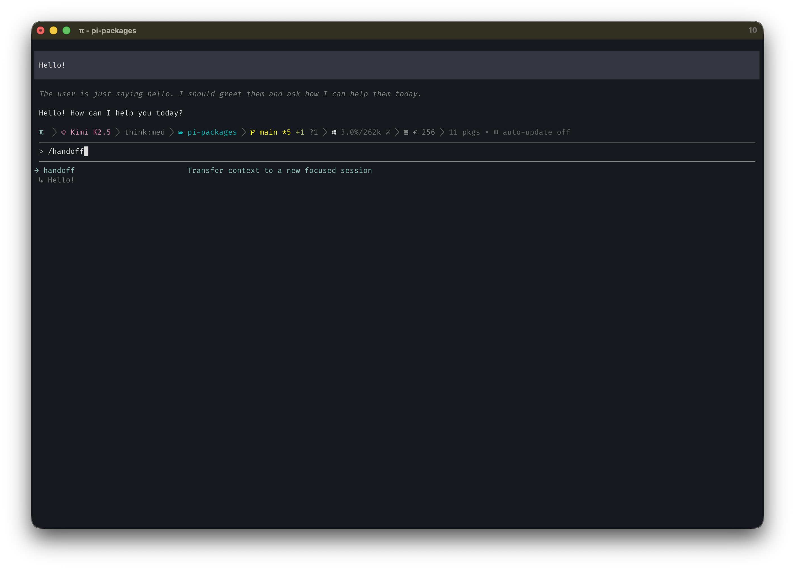

# pi-handoff



```bash
pi install @ssweens/pi-handoff
```

Context handoff extension for [pi](https://github.com/badlogic/pi-mono). Transfer context to a new session with a structured summary — the agent can trigger handoffs, or they happen automatically on compaction.

## Features

- **User preview/editing** — Review and edit the handoff draft before submission
- **Agent-callable handoff tool** — The model can initiate handoffs when explicitly asked
- **Auto-handoff on compaction** — Uses Pi's preparation data so summaries won't overflow
- **Structured format** — Bullet list with code pointers (path:line or path#Symbol)
- **Parent session query** — `session_query` tool for looking up details from parent sessions
- **Auto-inject skill** — Detects `Parent session:` references and enables query instructions automatically
- **System prompt hints** — The model knows about handoffs and suggests them proactively
- **Session naming** — New sessions named based on handoff goal

## Installation

### From npm

```bash
pi install @ssweens/pi-handoff
```

### From git (global)

```bash
pi install git:github.com/ssweens/pi-handoff
```

### From git (project-local)

```bash
pi install -l git:github.com/ssweens/pi-handoff
```

### Try without installing

```bash
pi -e git:github.com/ssweens/pi-handoff
```

### From local path (development)

Add to your settings (`~/.pi/agent/settings.json` or `.pi/settings.json`):

```json
{
  "packages": [
    "/path/to/pi-handoff"
  ]
}
```

## Features

### `/handoff <goal>` — Context Transfer

When your conversation gets long or you want to branch off to a focused task:

```
/handoff now implement this for teams as well
/handoff execute phase one of the plan
/handoff check other places that need this fix
```

This:
1. Analyzes your current conversation
2. Generates a structured handoff summary with:
   - Key decisions and approaches (as bullet points)
   - Relevant files with code pointers
   - Clear task description based on your goal
3. Opens an editor for you to review/modify the draft
4. Creates a new session with parent tracking
5. Sets up the prompt ready to submit

### Agent-Initiated Handoff

The model can also create handoffs when you explicitly ask:

```
"Please hand this off to a new session to implement the fix"
"Create a handoff to execute phase one"
```

The agent uses the `handoff` tool, which defers the handoff until after the current turn completes (so the tool result is properly recorded in the old session). In tool/hook contexts, it creates a new session file and rebases the active agent context to start at the handoff prompt, so the next turn runs with the handed-off context instead of the old oversized history.

### System Prompt Awareness

The extension injects handoff awareness into the system prompt. The model knows:
- `/handoff` exists and when to suggest it
- Handoffs after planning sessions are especially effective — clear context and start fresh with the plan
- At high context usage, it should suggest a handoff rather than losing context

### Auto-Handoff on Compaction

When auto-compaction triggers (context exceeds the compaction threshold), the extension intercepts and offers a choice: **handoff to a new session** or **compact in place**.

If you choose handoff:
1. A summary is generated (same structured format as `/handoff`)
2. You review/edit the handoff prompt
3. A new session is created with the summary, old session preserved
4. The agent continues in the new session

If you decline, normal compaction proceeds as usual.

**Requires `compaction.enabled = true`** (the default). When auto-compaction is disabled, this hook never fires — use `/handoff` manually instead.

### `session_query` Tool — Cross-Session Context

The model can query parent sessions for details not in the handoff summary:

```typescript
session_query("/path/to/parent/session.jsonl", "What files were modified?")
session_query("/path/to/parent/session.jsonl", "What approach was chosen for authentication?")
```

**Auto-injection:** When a user message contains a `**Parent session:**` reference, the extension prepends `/skill:pi-session-query` inline with the prompt body (single-submit flow, no extra Enter round-trip). No manual directive needed in handoff prompts.

**Size guard:** Large parent sessions are truncated (keeping the most recent context) to prevent exceeding context limits during the query.

## Handoff Format

Generated handoffs follow a structured format adapted from Pi's compaction system, filtered through the user's stated goal:

```markdown
# <goal>

**Parent session:** `/path/to/session.jsonl`

## Goal
What the user wants to accomplish in the new thread.

## Key Decisions
- **Decision 1**: Rationale (path/to/file.ts:42)
- **Decision 2**: Rationale

## Constraints & Preferences
- Requirements or preferences the user stated

## Progress
### Done
- [x] Completed work relevant to the goal

### In Progress
- [ ] Partially completed work

### Blocked
- Open issues or blockers

## Files
- path/to/file1.ts (modified)
- path/to/file2.ts (read)

## Task
Clear, actionable next steps based on the goal.
```

The `/skill:pi-session-query` directive is auto-injected when this prompt is submitted (detected via the `**Parent session:**` marker).

## Architecture Comparison

| Feature | pi-amplike | mina | pi-handoff |
|---------|-----------|------|------------|
| `/handoff` command | ✅ | ✅ | ✅ |
| Agent-callable tool | ✅ | ❌ | ✅ |
| User preview/edit | ❌ | ✅ | ✅ |
| Auto-handoff on compact | ❌ | ❌ | ✅ |
| Parent query tool | ✅ | ✅ | ✅ |
| Structured bullets | ❌ | ✅ | ✅ |
| Code pointers | ❌ | ✅ | ✅ |
| Auto-detect parent ref | ❌ | ✅ | ✅ |
| System prompt hints | ❌ | ✅ | ✅ |
| Session naming | ❌ | ❌ | ✅ |
| Query size guard | ❌ | ✅ | ✅ |
| Deferred tool switch | ✅ | N/A | ✅ |

## How It Differs from Compaction

| | Compaction (`/compact`) | Handoff (`/handoff`) | Auto-Handoff |
|---|---|---|---|
| **Purpose** | Reduce context size | Transfer to focused task | Context full → new session |
| **Trigger** | Automatic or `/compact` | User types `/handoff` | Intercepts auto-compaction |
| **Continues** | Same session | New session | New session |
| **Context** | Lossy summary | Goal-directed summary | Goal-directed summary |
| **Parent access** | Lost | Queryable via `session_query` | Queryable via `session_query` |
| **Use case** | General context overflow | Task branching | Preserve old session on overflow |

## Session Navigation

Use pi's built-in `/resume` command to switch between sessions. Handoff creates sessions with descriptive names based on your goal.

## Components

| Component | Type | Description |
|-----------|------|-------------|
| [handoff.ts](extensions/handoff.ts) | Extension | `/handoff` command, `handoff` tool, auto-handoff on compaction, system prompt hints |
| [session-query.ts](extensions/session-query.ts) | Extension | `session_query` tool for the model (with size guard) |
| [pi-session-query/SKILL.md](skills/pi-session-query/SKILL.md) | Skill | Instructions for using `session_query` |

## Configuration

No configuration required. The extension uses your current model for both handoff generation and session queries.

### Optional: Dedicated Query Model

To use a smaller/faster model for session queries (reducing cost), you can modify `session-query.ts` to use a different model:

```typescript
// In session-query.ts execute function, replace:
const model = ctx.model;

// With a specific model lookup:
const model = ctx.modelRegistry.find("anthropic", "claude-3-haiku") ?? ctx.model;
```

## License

MIT
