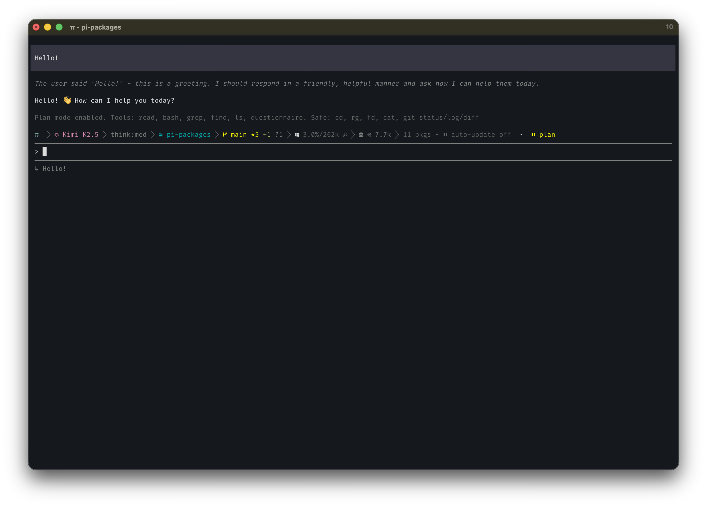
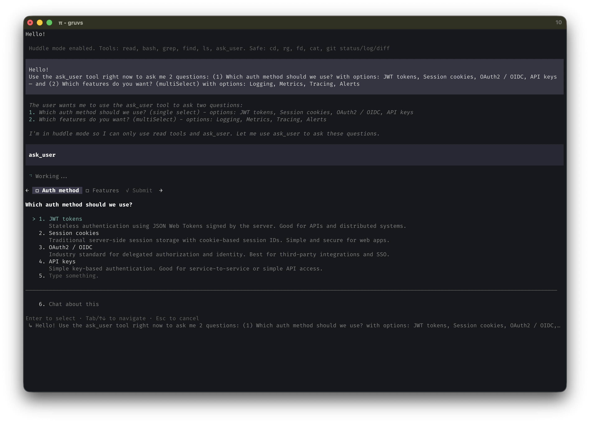

# pi-huddle





```bash
pi install @ssweens/pi-huddle
```

Huddle mode for [pi](https://github.com/badlogic/pi-mono). Safe exploration with permission gates, plus a powerful `ask_user` tool for structured multi-question elicitation. Toggle with `/huddle`, `/holup`, `/plan`, or `Alt+H`.

## Features

- **Huddle mode** — read-only by default; writes require your approval
- **`ask_user` tool** — rich TUI dialog for structured elicitation (available in all modes)
- **Permission gates** — approve or deny individual edit/write operations inline
- **Bash allowlist** — safe commands execute freely, destructive ones prompt first
- **Three commands** — `/huddle` (primary), `/holup`, `/plan` all toggle the mode
- **`Alt+H` shortcut** — Option+H on Mac
- **CLI flag** — `pi --plan` to start in huddle mode
- **Session persistence** — huddle state survives session resume

## Installation

```bash
pi install /path/to/pi-huddle

# Or project-local
pi install -l /path/to/pi-huddle
```

## Usage

### Toggle Huddle Mode

```
/huddle              # primary command
/holup               # alias
/plan                # alias (backward compat)
Alt+H (Option+H)     # keyboard shortcut
```

### Start in Huddle Mode

```bash
pi --huddle          # start pi directly in huddle mode
pi --plan            # alias (backward compat)
```

### Workflow

1. **Enter huddle mode** — `/huddle` or `Alt+H`
2. **Use `ask_user`** — gather requirements and clarify before acting
3. **Explore safely** — read, search, and analyze freely
4. **Approve edits on demand** — each write operation requires approval
5. **Exit when ready** — toggle off to restore full access

---

## ask_user Tool

The `ask_user` tool is available **in all modes** — not just huddle. It presents a rich TUI dialog with one tab per question, numbered options, freeform text input, and a submit/review view.

### Dialog UX

```
← □ Auth method  □ Library  ✓ Submit →

Which auth approach should I use?

  1. JWT tokens
     Stateless, scales well, standard choice.
  2. Session cookies
     Simpler for server-rendered apps.
  3. OAuth2 / OIDC
     Best for third-party login integration.
  4. API keys
     Simplest for machine-to-machine auth.
  5. |ype something.      ← freeform field, type immediately
  ────────────────────────────────────────
  6. Chat about this

Enter to select · Tab/↑↓ to navigate · Esc to cancel
```

- **Tab bar** — `←`/`→` or `Tab`/`Shift+Tab` to navigate between questions and Submit
- **Options** — `↑`/`↓` to move, `Enter` to select
- **Freeform** — navigate to row 5, start typing immediately; `Enter` to confirm
- **Chat about this** — tells the agent the user wants to discuss before deciding
- **Submit view** — recap of all answers before final submission
- **`multiSelect: true`** — `Space` or `Enter` to toggle, multiple selections allowed

### Tool Call Example

```json
{
  "questions": [
    {
      "question": "Which auth approach should I use?",
      "header": "Auth method",
      "options": [
        {
          "label": "JWT tokens (Recommended)",
          "description": "Stateless, scales well, standard choice",
          "markdown": "Authorization: Bearer <token>"
        },
        {
          "label": "Session cookies",
          "description": "Simpler for server-rendered apps"
        },
        {
          "label": "OAuth2 / OIDC",
          "description": "Best for third-party login integration"
        }
      ],
      "multiSelect": false
    },
    {
      "question": "Which features do you want to enable?",
      "header": "Features",
      "options": [
        { "label": "Logging", "description": "Structured JSON logs" },
        { "label": "Metrics", "description": "Prometheus /metrics endpoint" },
        { "label": "Tracing", "description": "OpenTelemetry spans" },
        { "label": "Alerts", "description": "PagerDuty integration" }
      ],
      "multiSelect": true
    }
  ]
}
```

### Return Value

```json
{
  "answers": {
    "Which auth approach should I use?": "JWT tokens (Recommended)",
    "Which features do you want to enable?": "Logging, Tracing"
  },
  "annotations": {},
  "metadata": {}
}
```

### Usage Notes

- 1–4 questions per call
- 2–4 options per question
- `markdown` field shows a code preview when an option is focused
- `multiSelect: true` for feature flags, configuration choices, etc.
- Put "(Recommended)" at end of preferred option label
- If user selects "Chat about this", agent should respond conversationally

---

## Permission Gates

### ✅ Always Allowed

| Tool | Description |
|------|-------------|
| `read` | Read file contents |
| `bash` | Allowlisted safe commands |
| `grep` | Search within files |
| `find` | Find files |
| `ls` | List directories |
| `ask_user` | Structured elicitation |

### ⚠️ Requires Permission

- **`edit`** — file modifications
- **`write`** — file creation/overwriting
- **Non-allowlisted bash commands**

### Permission Dialog

```
⚠ Huddle Mode — edit: /path/to/file.ts
[Allow]  [Deny]  [Deny with feedback]
```

**Deny with feedback** sends the reason to the agent so it can adjust.

### Safe Bash Commands (No Prompt)

`cat`, `head`, `tail`, `grep`, `find`, `rg`, `fd`, `ls`, `pwd`, `tree`,
`git status`, `git log`, `git diff`, `git branch`, `npm list`, `curl`, `jq`

Benign output redirections like `2>/dev/null` and `2>&1` are also allowed.

### Blocked Bash Commands (Prompt Required)

`rm`, `mv`, `cp`, `mkdir`, `touch`, `git add`, `git commit`, `git push`,
`npm install`, `yarn add`, `pip install`, `sudo`, `>`, `>>`

---

## Architecture

```
pi-huddle/
├── package.json          # Package manifest
├── extensions/
│   ├── index.ts          # Commands, shortcuts, ask_user tool, permission gates
│   └── lib/
│       ├── ask-user-dialog.ts  # TUI dialog component
│       └── utils.ts            # Bash command classification
├── skills/
│   └── huddle/
│       └── SKILL.md      # Teaches the agent huddle mode behaviour
├── LICENSE
└── README.md
```

Two pi primitives:

- **Extension** — registers `/huddle`, `/holup`, `/plan` commands, `Alt+H` shortcut, `ask_user` tool, permission gates, and context injection
- **Skill** — documents huddle mode and `ask_user` behaviour so the agent knows how to use them

## Development

```bash
/reload    # Hot-reload after editing
/huddle    # Test huddle mode
```

## License

[MIT](LICENSE)
