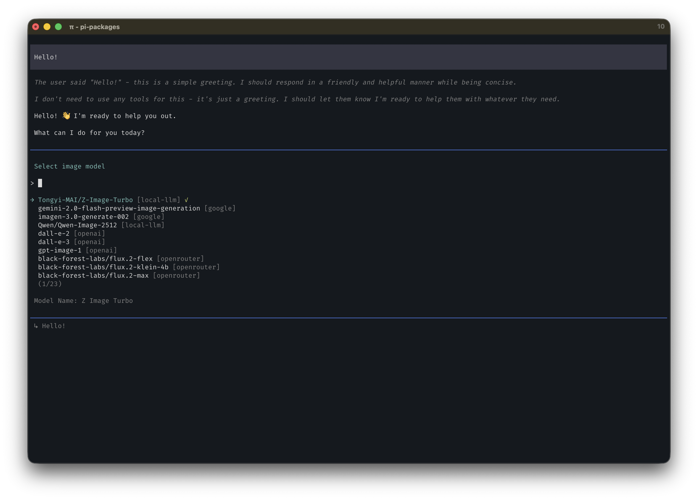

# pi-image-gen



```bash
pi install @ssweens/pi-image-gen
```

Image generation extension for [pi](https://github.com/badlogic/pi-mono). Adds a `generate_image` tool and `/image-model` selector. Supports OpenAI, Google, and OpenRouter providers, with runtime discovery of new models from OpenRouter.

## Features

- 🎨 **20+ built-in models** — OpenAI, Google Gemini, OpenRouter (FLUX, Seedream, Riverflow, and more)
- 🔄 **Runtime discovery** — Automatically finds new OpenRouter image models on startup
- ⚙️ **Custom providers** — Point at any compatible API via settings files
- 🖼️ **Aspect ratios & quality** — 1:1, 16:9, 9:16, 4:3, etc. with quality controls
- 💾 **Flexible save modes** — Project-local, global, or custom directory
- 🎯 **`/image-model` command** — Interactive fuzzy-search model picker with session persistence

## Install

```bash
pi install npm:@ssweens/pi-image-gen
# or from local path
pi install /path/to/pi-image-gen
```

## Usage

Just ask the agent to generate an image:

```
> Generate an image of a sunset over mountains

> Create a 16:9 wallpaper of a cyberpunk city using dall-e-3

> Make me a logo for a coffee shop, save it to the project
```

### Choosing a Model

Use `/image-model` — works in both Pi terminal and Minapi:

```
/image-model                                 # Interactive picker (fuzzy search)
/image-model openai/gpt-image-1              # Direct selection
/image-model openrouter/openai/gpt-5-image   # OpenRouter model
```

Selection persists in the session and shows in the status bar as `🎨 provider/model`.

## Built-in Providers & Models

Models are auto-generated from OpenRouter's API and static catalogs. Run `npm run generate-models` to refresh.

| Provider | Models | API Key | API Type |
|----------|--------|---------|----------|
| **openai** | `gpt-image-1`, `dall-e-3`, `dall-e-2` | `OPENAI_API_KEY` | `/v1/images/generations` |
| **google** | `gemini-2.0-flash-preview-image-generation`, `imagen-3.0-generate-002` | `GEMINI_API_KEY` | Gemini `generateContent` |
| **openrouter** | `openai/gpt-5-image`, `openai/gpt-5-image-mini`, `google/gemini-2.5-flash-image`, `google/gemini-3-pro-image-preview`, FLUX.2 variants, Seedream, Riverflow, and more | `OPENROUTER_API_KEY` | Chat completions |

## Resolution Order

When generating an image, the model is resolved in this order:

1. **Session selection** — `/image-model` command
2. **Settings file** — `defaultProvider` / `defaultModel` in `pi-image-gen.json`
3. **Default** — first available OpenRouter model, then OpenAI

## Configuration

### Custom Models via Settings

Define image providers in `~/.pi/agent/settings/pi-image-gen.json` (global) or `<project>/.pi/settings/pi-image-gen.json` (project-local, overrides global):

```json
{
  "defaultProvider": "local-llm",
  "defaultModel": "my-local-image-model",
  "providers": {
    "local-llm": {
      "baseUrl": "http://192.168.1.51:9999/v1",
      "apiKey": "MY_API_KEY",
      "api": "openai-images",
      "models": [
        {
          "id": "my-local-image-model",
          "name": "My Local Image Model",
          "cost": 0
        }
      ]
    }
  }
}
```

### Supported API Types

| Type | Used By | Endpoint |
|------|---------|----------|
| `openai-images` | OpenAI direct | `POST /v1/images/generations` |
| `openai-chat-image` | OpenRouter | `POST /v1/chat/completions` with `modalities: ["image"]` |
| `google-generative-ai-image` | Google Gemini | `POST /models/{id}:generateContent` |

Model-level `api` overrides provider-level `api`.

### Legacy: `models.json`

`pi-image-gen` also reads `providers.<name>.models[]` entries in `~/.pi/agent/models.json` that are tagged with `output: ["image"]`. This is lower priority than the settings file.

## Save Modes

| Mode | Location |
|------|----------|
| `none` | Don't save (default) |
| `project` | `<repo>/.pi/generated-images/` |
| `global` | `~/.pi/agent/generated-images/` |
| `custom` | `saveDir` param or `PI_IMAGE_SAVE_DIR` |

## Tool Parameters

The `generate_image` tool accepts:

| Parameter | Type | Default | Description |
|-----------|------|---------|-------------|
| `prompt` | string | *required* | Description of the image to generate |
| `aspectRatio` | string | `1:1` | `1:1`, `2:3`, `3:2`, `3:4`, `4:3`, `4:5`, `5:4`, `9:16`, `16:9`, `21:9` |
| `imageSize` | string | `1K` | `1K`, `2K`, `4K` (OpenRouter models only) |
| `quality` | string | `auto` | `auto`, `low`, `medium`, `high` (OpenAI direct only) |
| `save` | string | `none` | `none`, `project`, `global`, `custom` |
| `saveDir` | string | — | Directory for `save=custom` |
| `timeout` | number | `600` | Generation timeout in seconds |

## Pi Integration

- **API keys** — Resolved via `ctx.modelRegistry.getApiKeyForProvider()` (env vars, auth.json, OAuth)
- **Base URLs** — From model data, settings providers, or Pi's registry
- **Custom providers** — Define in `~/.pi/agent/settings/pi-image-gen.json`

## Architecture

Mirrors Pi's text model pipeline:

| Layer | Pi (text) | pi-image-gen |
|-------|-----------|--------------|
| Build-time discovery | `generate-models.ts` → `models.generated.ts` | `generate-image-models.ts` → `image-models.generated.ts` |
| Runtime discovery | None | OpenRouter `/v1/models` on startup (24h cache) |
| Sources | models.dev, OpenRouter, AI Gateway | OpenRouter (`output_modalities: ["image"]`), static catalog |
| Custom models | `models.json` providers | `settings/pi-image-gen.json` (preferred) + legacy `models.json` |
| API key resolution | `ModelRegistry.getApiKeyForProvider()` | Same |
| Model selection | Ctrl+P / model selector | `/image-model` command |

### Model Priority (lowest → highest)

1. **Built-in generated** — `image-models.generated.ts` (baked into package)
2. **Runtime discovered** — OpenRouter API fetch, cached at `~/.pi/agent/cache/pi-image-gen-discovered.json` (24h TTL)
3. **Legacy `models.json`** — `providers.<name>.models[]` entries with `output: ["image"]`
4. **Settings providers** — `providers` in `pi-image-gen.json` settings file
5. **Session selection** — `/image-model` command or tool params

## Adding Providers

1. Add static models to `scripts/generate-image-models.ts`
2. Or add a new dynamic fetch function (like `fetchOpenRouterImageModels`)
3. Run `npm run generate-models`
4. Add generation logic in `extensions/image-gen.ts` if a new API type is needed

## License

[MIT](LICENSE)
