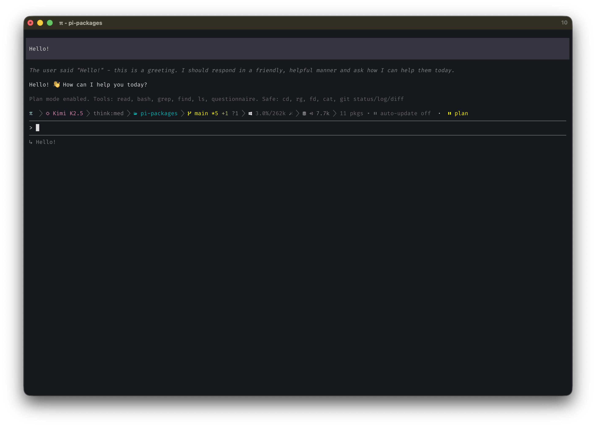

# pi-plan-mode



```bash
pi install @ssweens/pi-plan-mode
```

Read-only exploration mode for [pi](https://github.com/badlogic/pi-mono). The agent can read anything freely, but file writes and destructive commands require your approval. Toggle with `/plan` or `Alt+P`.

## Features

- **Permission-gated exploration** — read-only by default, writes require approval
- **Just-in-time permissions** — approve or deny individual edit/write operations inline
- **Bash allowlist** — safe commands execute freely, destructive ones prompt for permission
- **Simple toggle** — enter/exit plan mode with `/plan` or `Alt+P` (Option+P on Mac)
- **CLI flag** — start pi directly in plan mode with `pi --plan`
- **Session persistence** — plan mode state survives session resume
- **Agent-aware** — includes a skill that teaches the agent how to behave in plan mode

## Installation

```bash
# Install from a local path
pi install /path/to/pi-plan-mode

# Or project-local installation
pi install -l /path/to/pi-plan-mode
```

After installation, your pi settings will include:

```json
{
  "packages": [
    "/path/to/pi-plan-mode"
  ]
}
```

## Usage

### Toggle Plan Mode

```
/plan                    # Toggle plan mode on/off
Alt+P (Option+P on Mac) # Keyboard shortcut
```

### Start in Plan Mode

```bash
pi --plan               # Start pi directly in plan mode
```

### Workflow

1. **Enter Plan Mode** — `/plan` or `Alt+P`
2. **Explore safely** — read, search, and analyze with zero risk
3. **Approve edits on demand** — if the agent needs to fix something, you approve each operation individually
4. **Exit when ready** — toggle off to restore full tool access and execute your plan

## Permission Gates

During plan mode, operations fall into three categories:

### ✅ Always Allowed

| Tool | Description |
|------|-------------|
| `read` | Read file contents |
| `bash` | Allowlisted safe commands only |
| `grep` | Search within files |
| `find` | Find files |
| `ls` | List directories |
| `questionnaire` | Ask clarifying questions |

### ⚠️ Requires Permission

These operations show a permission dialog before executing:

- **`edit`** — file modifications
- **`write`** — file creation/overwriting
- **Non-allowlisted bash commands** — anything outside the safe list

### Permission Dialog

When a gated operation is attempted, you'll see:

```
┌─────────────────────────────────────────┐
│ ⚠ Plan Mode — edit: /path/to/file.ts   │
├─────────────────────────────────────────┤
│  [Allow]  [Deny]  [Deny with feedback]  │
└─────────────────────────────────────────┘
```

Choose **Deny with feedback** to tell the agent _why_ you denied the operation — the feedback is injected into the conversation so the agent can adjust its approach.

## Bash Command Categories

### Safe Commands (No Prompt)

- **File inspection:** `cat`, `head`, `tail`, `less`, `more`
- **Search:** `grep`, `find`, `rg`, `fd`
- **Directory:** `ls`, `pwd`, `tree`
- **Git (read-only):** `git status`, `git log`, `git diff`, `git branch`
- **Package info:** `npm list`, `npm outdated`
- **Utilities:** `curl`, `jq`, `uname`, `whoami`, `date`

### Blocked Commands (Prompt Required)

- **File mutation:** `rm`, `mv`, `cp`, `mkdir`, `touch`
- **Git writes:** `git add`, `git commit`, `git push`, `git rebase`
- **Package installs:** `npm install`, `yarn add`, `pip install`
- **System:** `sudo`, `kill`, `reboot`
- **Redirections:** `>`, `>>`

## Architecture

```
pi-plan-mode/
├── package.json          # Package manifest with pi configuration
├── extensions/
│   ├── index.ts          # Extension: commands, shortcuts, permission gates
│   └── lib/
│       └── utils.ts      # Bash command classification (safe vs destructive)
├── skills/
│   └── plan-mode/
│       └── SKILL.md      # Skill: teaches the agent plan mode behavior
├── LICENSE
└── README.md
```

The package provides two pi primitives:

- **Extension** (`extensions/`) — registers the `/plan` command, `Alt+P` shortcut, permission gates on `tool_call` events, and context injection via `before_agent_start`
- **Skill** (`skills/`) — documents plan mode behavior so the agent understands its constraints and workflow

## Development

```bash
# Edit files in the package directory, then:
/reload    # Hot-reload the extension in pi
/plan      # Test plan mode
```

## License

[MIT](LICENSE)
