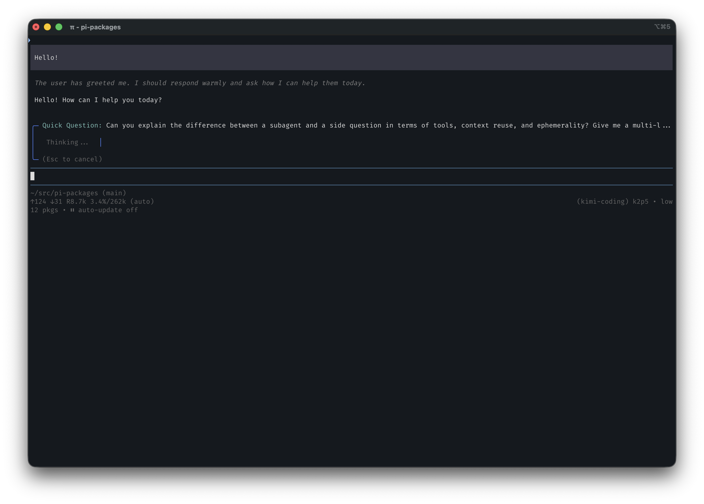

# pi-qq

Ask a quick side question about your current coding session without interrupting the main agent or cluttering your history.



## Usage

```
/qq <question>
/btw <question>
```

## Features

- **Scrollable Pager**: Use **Up/Down Arrow Keys** or **Page Up/Down** to navigate long responses.
- **Visual Scrollbar**: A right-rail scrollbar indicates your position in the response.
- **Ephemeral**: The side-quest is strictly visual. It never enters your conversation history and doesn't affect future Claude turns.
- **Parallel Execution**: Ask a side question even while Claude is busy processing a long response.
- **No Tool Access**: Guaranteed fast responses by disabling Claude's ability to read files or run commands for the side-quest.

## How it works

- Press **Space**, **Enter**, or **Escape** to dismiss the box.
- Press **Escape** at any time to instantly cancel a pending request.

## Installation

```bash
pi install npm:@ssweens/pi-qq
```
