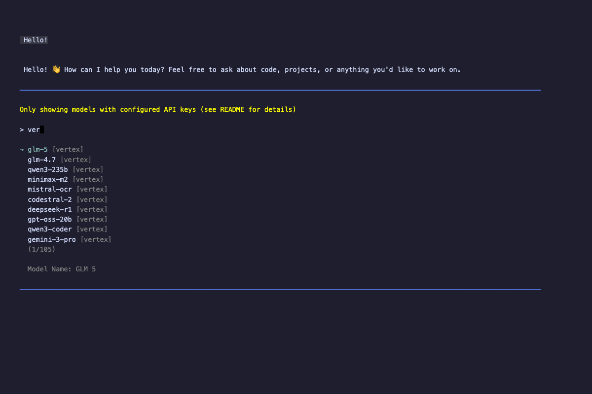

# pi-vertex

[](https://www.npmjs.com/package/@ssweens/pi-vertex)
[](LICENSE)



```bash
pi install @ssweens/pi-vertex
export GOOGLE_CLOUD_PROJECT=your-project-id
export GOOGLE_APPLICATION_CREDENTIALS=/path/to/key.json
```

Set your GCP project and credentials. Vertex AI models (Gemini, Claude, Llama, DeepSeek, Qwen, Mistral, and others) appear in pi's model selector, billed through your GCP project.

## Features

- **45 models** across 4 categories:
  - **Gemini** (9): 3.1 Pro, 3.1 Flash-Lite, 3 Flash, 2.5 Pro, 2.5 Flash, 2.5 Flash-Lite, 2.0 Flash, 2.0 Flash-Lite
  - **Claude** (11): Opus 4.8, Opus 4.7, Opus 4.6, Sonnet 4.6, Opus/Sonnet/Haiku 4.5, Opus 4.1, Opus 4, Sonnet 4, 3.5 Sonnet v2
  - **Llama** (3): 4 Maverick, 4 Scout, 3.3 70B
  - **Other MaaS** (22): Grok 4.3, Grok 4.20, Grok 4.1 Fast, Gemma, Mistral, DeepSeek, Qwen, OpenAI GPT-OSS, Kimi, MiniMax, GLM

- **Unified streaming**: Single provider, multiple model families
- **Full tool calling support**: All models with multi-turn tool use and proper tool result handling
- **Thinking/reasoning**: Gemini 3 thinking levels, Gemini 2.5 thinking budgets, thought signature preservation
- **Automatic auth**: Uses Google Application Default Credentials
- **Region awareness**: Global endpoints where supported, regional where required
- **Pricing tracking**: Built-in cost per token for all models (including thinking tokens and regional endpoint premiums)

## Installation

```bash
# Via pi (recommended)
pi install @ssweens/pi-vertex

# Or via npm
npm install @ssweens/pi-vertex
```

## Setup

### 1. Authenticate with Google Cloud

```bash
# Option A: User credentials (development)
gcloud auth application-default login

# Option B: Service account (production)
export GOOGLE_APPLICATION_CREDENTIALS=/path/to/service-account-key.json
```

### 2. Set environment variables

```bash
# Required: Your GCP project ID
export GOOGLE_CLOUD_PROJECT=your-project-id

# Optional: Override default region
export GOOGLE_CLOUD_LOCATION=us-central1
```

### 3. Configuration file (optional)

For persistent settings, create `~/.pi/agent/settings/pi-vertex.json`:

```json
{
  "googleCloudProject": "my-gcp-project",
  "googleCloudLocation": "us-central1",
  "googleApplicationCredentials": "/path/to/service-account.json"
}
```

Config file values take priority over environment variables.

### 4. Verify setup

```bash
pi --provider vertex --model gemini-2.5-pro --version
```

## Usage

### Command line

```bash
# Use any supported model
pi --provider vertex --model claude-opus-4-8
pi --provider vertex --model grok-4.3
pi --provider vertex --model gemini-2.5-pro
pi --provider vertex --model llama-4-maverick
pi --provider vertex --model deepseek-v3.2

# With options
pi --provider vertex --model claude-sonnet-4-6 --reasoning high
```

### Shell alias (recommended)

Add to `~/.bashrc` or `~/.zshrc`:

```bash
# Claude 4.8 Opus
alias pic="GOOGLE_CLOUD_PROJECT=your-project pi --provider vertex --model claude-opus-4-8"

# Grok 4.3
alias pig4="GOOGLE_CLOUD_PROJECT=your-project pi --provider vertex --model grok-4.3"

# Gemini 2.5 Pro
alias pig="GOOGLE_CLOUD_PROJECT=your-project pi --provider vertex --model gemini-2.5-pro"

# Llama 4 Maverick
alias pil="GOOGLE_CLOUD_PROJECT=your-project pi --provider vertex --model llama-4-maverick"
```

## Model Reference

### Gemini Models

| Model | Context | Max Tokens | Input | Reasoning | Price (in/out) |
|-------|---------|------------|-------|-----------|----------------|
| gemini-3.1-pro | 1M | 65,536 | text, image | ✅ | $2.00/$12.00 |
| gemini-3.1-flash-lite | 1M | 65,535 | text, image | ✅ | $0.25/$1.50 |
| gemini-3-pro | 1M | 65,536 | text, image | ✅ | $2.00/$12.00 |
| gemini-3-flash | 1M | 65,536 | text, image | ✅ | $0.50/$3.00 |
| gemini-2.5-pro | 1M | 65,536 | text, image | ✅ | $1.25/$10.00 |
| gemini-2.5-flash | 1M | 65,536 | text, image | ✅ | $0.30/$2.50 |
| gemini-2.5-flash-lite | 1M | 65,536 | text, image | ✅ | $0.10/$0.40 |
| gemini-2.0-flash | 1M | 8,192 | text, image | ❌ | $0.15/$0.60 |
| gemini-2.0-flash-lite | 1M | 8,192 | text, image | ❌ | $0.075/$0.30 |

### Claude Models

Prices shown are for the **global** endpoint. Non-global regions (us-east5, europe-west1, asia-southeast1, us/eu multi-region) carry a 10% premium — cost tracking adjusts automatically based on your configured `GOOGLE_CLOUD_LOCATION`.

| Model | Context | Max Tokens | Input | Reasoning | Price global (in/out) | Price regional (in/out) |
|-------|---------|------------|-------|-----------|----------------------|------------------------|
| claude-opus-4-8 | 1M | 128,000 | text, image | ✅ | $5.00/$25.00 | $5.50/$27.50 |
| claude-opus-4-7 | 1M | 128,000 | text, image | ✅ | $5.00/$25.00 | $5.50/$27.50 |
| claude-opus-4-6 | 1M | 128,000 | text, image | ✅ | $5.00/$25.00 | $5.50/$27.50 |
| claude-sonnet-4-6 | 1M | 128,000 | text, image | ✅ | $3.00/$15.00 | $3.30/$16.50 |
| claude-opus-4-5 | 200K | 32,000 | text, image | ✅ | $5.00/$25.00 | $5.50/$27.50 |
| claude-sonnet-4-5 | 200K | 64,000 | text, image | ✅ | $3.00/$15.00 | $3.30/$16.50 |
| claude-haiku-4-5 | 200K | 64,000 | text, image | ✅ | $1.00/$5.00 | $1.10/$5.50 |
| claude-opus-4-1 | 200K | 32,000 | text, image | ✅ | $15.00/$75.00 | (uniform) |
| claude-opus-4 | 200K | 32,000 | text, image | ✅ | $15.00/$75.00 | (uniform) |
| claude-sonnet-4 | 200K | 64,000 | text, image | ✅ | $3.00/$15.00 | (uniform) |
| claude-3-5-sonnet-v2 | 200K | 8,192 | text, image | ❌ | $3.00/$15.00 | (uniform) |

### Llama Models

| Model | Context | Max Tokens | Input | Reasoning | Price (in/out) | Region |
|-------|---------|------------|-------|-----------|----------------|--------|
| llama-4-maverick | 524K | 32,000 | text | ✅ | $0.35/$1.15 | global |
| llama-4-scout | 1,310K | 32,000 | text | ✅ | $0.25/$0.70 | global |
| llama-3.3-70b | 128K | 8,192 | text | ❌ | $0.72/$0.72 | global |

### Other MaaS Models

| Model | Context | Publisher | Price (in/out) | Region |
|-------|---------|-----------|----------------|--------|
| mistral-medium-3 | 128K | mistralai | $0.40/$2.00 | global |
| mistral-small-3.1 | 128K | mistralai | $0.10/$0.30 | global |
| mistral-ocr | 30 pages | mistralai | $0.0005/page | global |
| codestral-2 | 128K | mistralai | $0.30/$0.90 | global |
| deepseek-v3.2 | 163K | deepseek-ai | $0.56/$1.68 | global |
| deepseek-v3.1 | 163K | deepseek-ai | $0.60/$1.70 | global |
| deepseek-r1 | 163K | deepseek-ai | $1.35/$5.40 | global |
| deepseek-ocr | Varies | deepseek-ai | $0.0003/page | global |
| qwen3-235b | 262K | qwen | $0.22/$0.88 | global |
| qwen3-next-instruct | 262K | qwen | $0.15/$1.20 | global |
| qwen3-next-thinking | 262K | qwen | $0.15/$1.20 | global |
| qwen3-coder | 262K | qwen | $0.22/$1.80 | global |
| gpt-oss-120b | 131K | openai | $0.09/$0.36 | global |
| gpt-oss-20b | 131K | openai | $0.07/$0.25 | global |
| kimi-k2-thinking | 262K | moonshotai | $0.60/$2.50 | global |
| minimax-m2 | 196K | minimaxai | $0.30/$1.20 | global |
| glm-5 | 200K | zai-org | $1.00/$3.20 | global |
| glm-4.7 | 200K | zai-org | $0.60/$2.20 | global |
| grok-4.3 | 1M | xai | $1.25/$2.50 | global |
| grok-4.20-reasoning | 1M | xai | $1.25/$2.50 | global |
| grok-4.1-fast-reasoning | 2M | xai | $0.20/$0.50 | global |
| gemma-4-26b-a4b-it | 262K | google | $0.15/$0.60 | global |

## Regional Endpoints

Models use different endpoints based on availability:

- **Global** (most models): `aiplatform.googleapis.com`
- **Regional** (older Claude models): `{region}-aiplatform.googleapis.com`

Default regions by model:
- Gemini: `global`
- Claude (all): `global`
- MaaS: `global`

Override with:
```bash
export GOOGLE_CLOUD_LOCATION=us-central1
```

## Architecture

```
┌─────────────┐
│     Pi      │
└──────┬──────┘
       │ registerProvider("vertex")
       ▼
┌─────────────┐
│  pi-vertex  │
└──────┬──────┘
       │ streamSimple(model, context, options)
       ▼
┌─────────────────────────────────────┐
│         Handler Dispatch            │
├──────────────┬──────────────────────┤
│   Gemini     │        MaaS          │
│  (@google/   │  (OpenAI-compatible  │
│   genai)     │   endpoint)          │
└──────────────┴──────────────────────┘
```

## Dependencies

- `@google/genai`: Google GenAI SDK for Gemini models
- `@anthropic-ai/vertex-sdk`: Official Anthropic-on-Vertex SDK for Claude models (native streaming)
- `google-auth-library`: ADC authentication for all models
- `@mariozechner/pi-ai`: Peer dependency
- `@mariozechner/pi-coding-agent`: Peer dependency

## Acknowledgments

[lhl](https://github.com/lhl) maintains [lhl/pi-vertex](https://github.com/lhl/pi-vertex), an independent fork that added comprehensive unit tests and CI, and identified several important bugs. Several fixes in v1.1.6 were co-discovered through review of that work, including the `maxTokens/2` halving bug, Gemini cached-token double-counting, `sanitizeText` emoji corruption, missing tool result flushing, and image tool result forwarding. Kudos.

## License

MIT
